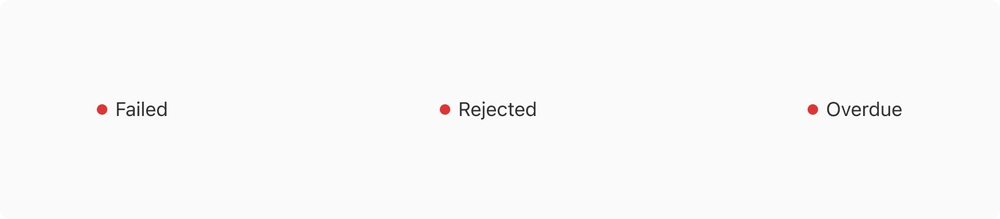

Status hints are used to indicate the status of an entity.

### Appearance

Status hint comes in 5 Appearances -

#### Info

 
 

 

#### Warning 

 
 

 

#### Success

 
 

#### Alert

 
 

 

#### Default

 
 

 

### Properties
<table style="width: 100%">
  <tbody>
    <tr>
      <th style="width:33%; text-align: left;">Property</th>
      <th style="width:33%; text-align: left;">Value(s)</th>
      <th style="width:33%; text-align: left;">Default value</th>
    </tr>
    <tr style="vertical-align: top">
      <td>Appearance</td>
      <td>
        <ul>
            <li>Default</li>
            <li>Info</li>
            <li>Success</li>
            <li>Warning</li>
            <li>Alert</li>
        </ul>
      </td>
      <td>Default</td>
    </tr>
    <tr style="vertical-align: top">
      <td>Label</td>
      <td>&#60;label&#62;</td>
      <td>-</td>
    </tr>
  </tbody>
</table>
 

### Usage 

 

#### Overflow behavior

When the label is too long to fit the horizontal space available, it wraps to form another line.

 
 

#### Status hint vs. Badge

A status hint is used to indicate the status of an entity whereas a badge is used to tag the entities. 

 
 