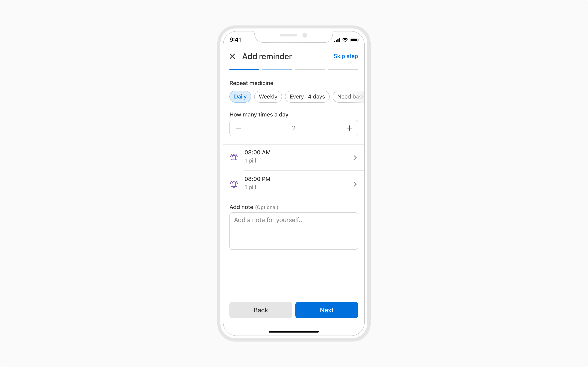
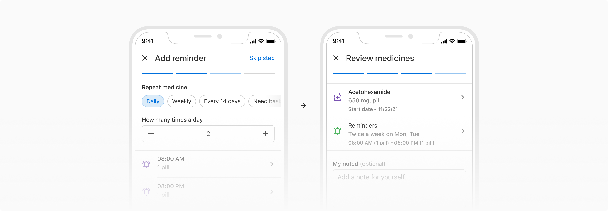
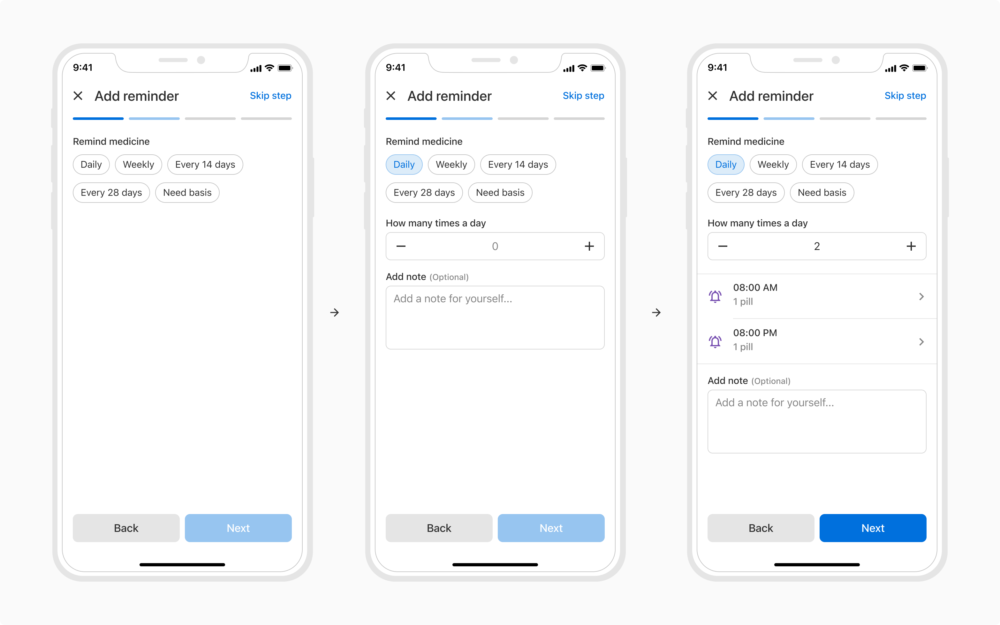
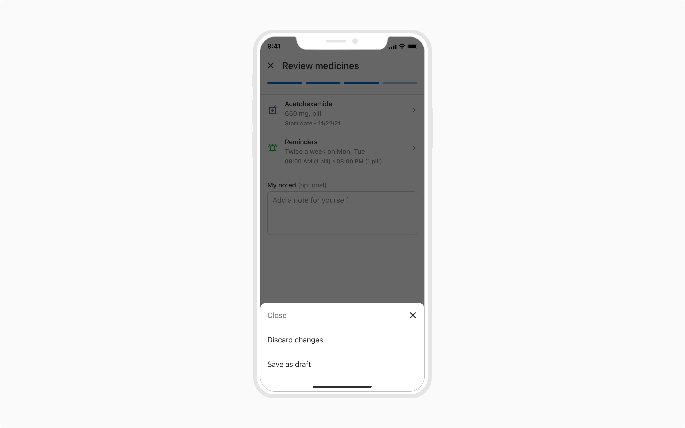

Stepper is used to help users keep track of their progress in a multi-step workflow. It is recommended to break down a long process into multiple steps using a stepper to help users keep track of their progress while completing a task.

 

### Structure

 

### Properties
<table style="width: 100%">
  <tbody>
    <tr>
      <th style="width:33%; text-align: left;">Property</th>
      <th style="width:33%; text-align: left;">Value(s)</th>
      <th style="width:33%; text-align: left;">Default value</th>
    </tr>
    <tr style="vertical-align: top">
      <td>Height (of a stepper item)</td>
      <td>4px</td>
      <td>-</td>
    </tr>
    <tr style="vertical-align: top">
      <td>Width</td>
      <td>&#60;width&#62;</td>
      <td>343px</td>
    </tr>
    <tr style="vertical-align: top">
      <td>Corner radius (of the active stepper item)</td>
      <td>4px</td>
      <td>-</td>
    </tr>
    <tr style="vertical-align: top">
      <td>Spacing between stepper items</td>
      <td>0px</td>
      <td>-</td>
    </tr>
  </tbody>
</table>
 

### Usage

 

#### Actions placement

 

##### Back and Next actions

Back and Next actions are placed at the bottom of the screen.

##### Cancel action

To cancel or close the entire process, the close button is present in the header.

##### Skip action

To skip a specific step, a label button is used in the header.

 
 

#### Skipping a step

A stepper can also have a skippable/optional step. Users can skip the step for the time being and can navigate back to it, to fill it again before completing the progress.

In case of an optional step, an additional step-specific action “Skip step” gets added in the header.

 
 

##### Skipping the last step

In case the last step is supposed to be optional, relabel the Skip button to **Skip** and **Finish**.

 
 

#### Mandatory vs. Optional step

In case of a mandatory step, the 'Next' button is disabled until and unless all the required fields are completed.

In case of an optional step, the entire step can be skipped using the **"Skip step"** button in top right. But if the users want to fill that step, the **'Next'** button becomes enabled when at least 1 field is completed.

**Note:** If a conditional workflow is triggered in an optional step that has some required fields, the 'Next' button remains disabled until all such fields are completed.

#### Closing the process

An action sheet can be used to present additional closing actions such as 'Save as draft' before closing the process using the stepper.

