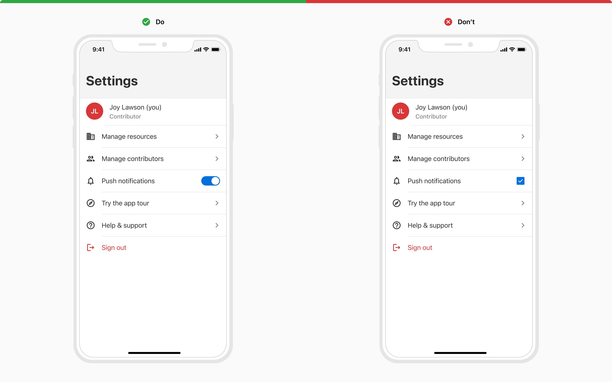
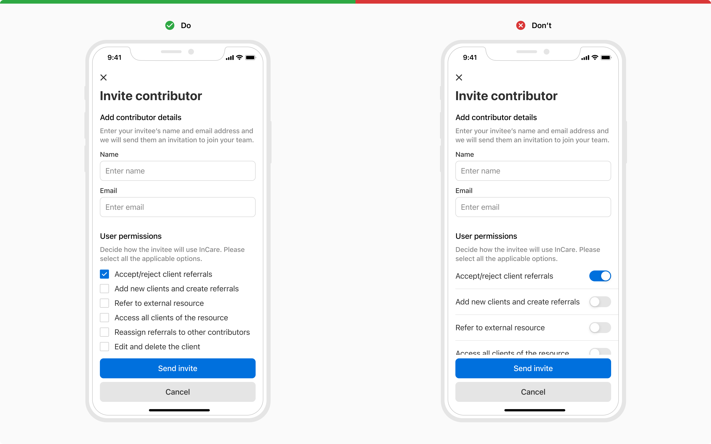

Switch is used to toggle between two states in a user interface - ON and OFF, hence resembling the real-life switch that is used to turn something ON or OFF.

### States
The switch comes in **2 selection states** - ON and OFF. And each of these states can have **3 interactive states** - default, active and disabled.

#### ON

 

#### OFF

 

### Usage
#### Switch vs. Checkbox
 

<table style="width: 100%">
    <thead>
        <tr>
            <th align="left">Switch</th>
            <th align="left">Checkbox</th>
        </tr>
    </thead>
    <tbody>
        <tr>
            <td>Selection & execution at the same time</td>
            <td>Just selection as execution requires another control</td>
        </tr>
        <tr>
            <td>Instant response</td>
            <td>Explicit action is required to confirm the response</td>
        </tr>
        <tr>
            <td>Best to use independently</td>
            <td>Best to use in forms</td>
        </tr>
    </tbody>
</table>
 
 

 
 

 
 