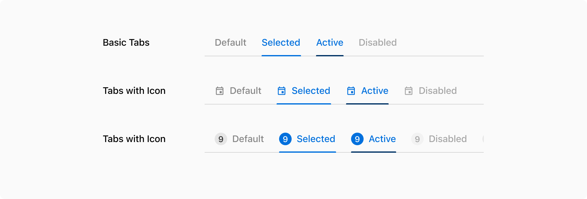
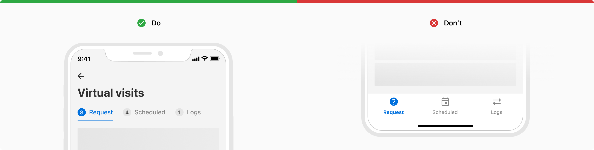
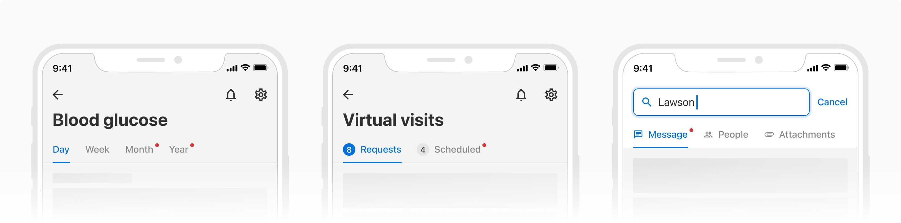
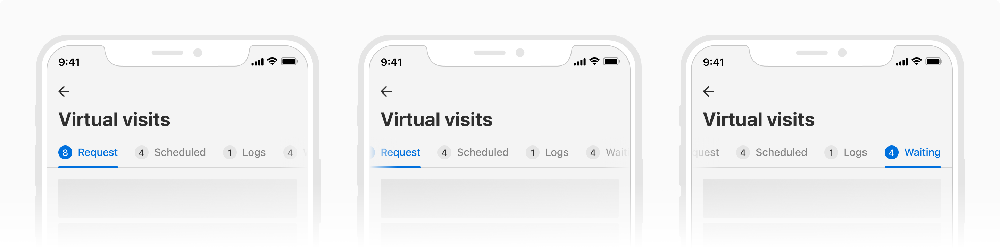

Tabs are used to navigate between segregated content that is related and is at the same level of hierarchy.

### Variants
Tabs come in **3 variants** - default, with icon and with count.

#### Default
Default variant consists of just a label.

 

#### With icon
This variant consists of an icon along with the label. Icons should only be used when they add additional value to the label. 

 

#### With count
This variant displays the count along with the label.
 

 
 

### States
Tabs come in **4 states** - default, selected, active, and disabled.

 
 

### Usage
#### Tabs vs bottom navigation
Tabs are used to group related content and act as filters. While bottom navigation on the other hand is used to navigate between independent pages.

 
 

#### Notifications
Notifications can be shown with a red dot alongside the label to indicate the availability of new information. It can be used in combination with any of the tab variants.

 
 

#### Overflow behavior
Tabs can scroll horizontally if the width of the tab group exceeds the viewport. A linear gradient shows up on either edge to indicate the overflowed tabs. 

**Note**: Whenever possible, the selected tab should be at the center of the screen in case of an overflow.

 
 

#### Tab label
Tabs should have short and scannable labels, generally limited to a single word.

#### Maximum tabs
Too many tabs can unnecessarily clutter the UI. Hence it is recommended to **not use more than 5 tabs** at once. However, it is possible to use more than 5 tabs if the need arises. 