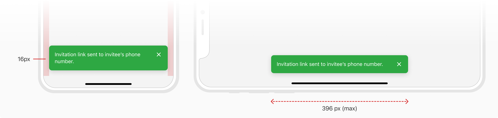
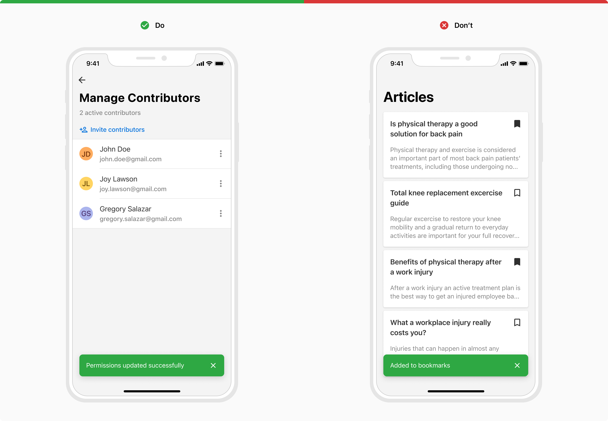
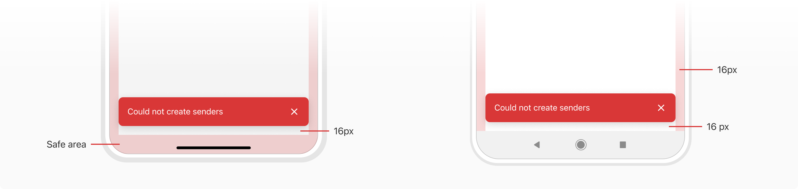

Toast is used to give feedback to the users about an action they took. It appears temporarily, at the bottom of the screen. 

### Appearance
Toast comes in **4 appearances** basis on the intent - info, alert, warning and success.

#### Info
Info variant is used to convey information to the users.

Information may be generic like - ‘New updates available’, ‘Your consent was recorded’ or convey an in-between state of a process like - ‘Export is in process’, ‘Uploading file items’, and more.

 

#### Alert
Alert variant is used to convey an error state or failure which blocks a process.

The error may be generic like - ‘User not found’, ‘Mobile number already registered’, or failure of a process like - ‘Could not create users’, ‘File items could not be uploaded’, and more.

 

#### Warning
Warning variant is used to convey an interrupted state which delays or prevents a process from completion.

Interruption may be in the form - ‘2 permissions denied to Joy Lawson’, ‘1 file could not be downloaded’, and more.

 

#### Success
Success variant is used to convey the success state of a task/process.

Successful completion may be in the form of - ‘Mail sent’, ‘User deleted’, ‘Mobile number verified’, ‘Meeting scheduled’, and more.

 

### Usage
#### Width
A toast spans the width of the device leaving a horizontal margin of 16px until it reaches the maximum width of 396px. It is always center aligned vertically. Hence,
* **In smaller screens** like mobile (portrait orientation), a toast scales to fit the screens while leaving a 16px margin on both sides.
* **In wider UIs** such as mobile (landscape orientation) and tablets, a toast reaches it maximum width, i.e. 396 pixels.

Note that in both the cases, it is vertically center aligned.

 

#### When to use toasts
If the UI changes as a result of the action that users took, then the UI itself is enough to convey the feedback. There is no need to show a toast for such cases. But if the actions do not have a direct impact on the UI then toasts should be considered.

**Note**: In the example below the state of the icon is enough to give feedback to the users, and hence there is no need to show a toast.

 

#### Placement
Toasts appear at the bottom of the screen (aligned centrally) in front of any content. However, as toasts are intended to be minimally interruptive avoid placing them in front of frequently used touch targets or navigation.

 

#### Toast with Actions
Use toast with actions when you want the users to take an action after reading the message.

 

#### Dismissing Behavior
Toasts appear temporarily and disappear on their own **after a default timeout of 5 seconds**. The timeout time can range from a minimum of 4 seconds to a maximum of 10 seconds. They can also be dismissed by tapping any of the available actions.

If needed, this timeout behavior can be turned off.