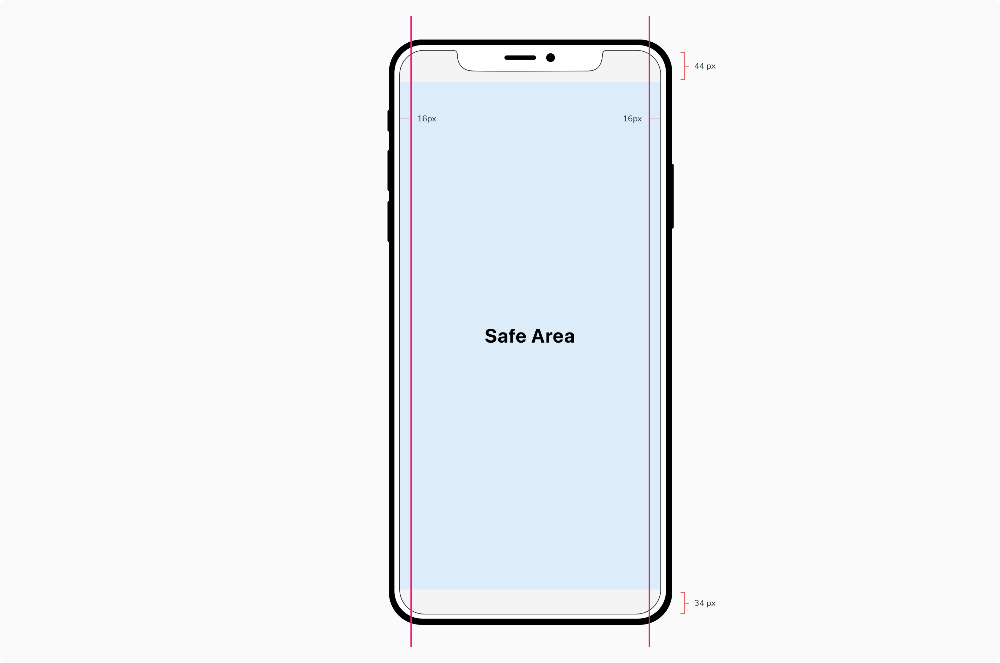

### Screen size
iOS devices offer a variety of screen sizes and resolutions to work with. Each and every device has different values of pixel density, size in points, etc.

Refer to the following table to see all the specifications for iPhone 11 Pro:

<table style="width: 100%">
  <tbody>
    <tr>
      <th style="width:20%; text-align: left;">Device</th>
      <th style="width:20%; text-align: left;">Points</th>
      <th style="width:20%; text-align: left;">Rendered at</th>
      <th style="width:20%; text-align: left;">Rendered pixels</th>
      <th style="width:20%; text-align: left;">Physical device size</th>
    </tr>
    <tr style="vertical-align: top">
      <td>iPhone 11 Pro</td>
      <td>375 x 812</td>
      <td>3x</td>
      <td>1125 x 2436</td>
      <td>5.8"</td>
    </tr>
  </tbody>
</table>
 

**Note:** In Figma, design on 1x scale where 1pt = 1px. Refer to this [article](https://medium.com/@peternowell/pixel-density-demystified-a4db63ba2922) to know more.

### Safe area & margins
Safe area helps you place your content within the visible portion of the overall interface i.e. positioning of your content so that they are not obstructed by other content.

A standard margin of 16 px is applied around the content to restrict the width of the content for optimal readability.

**Note:** Actions in headers (Icon and Label button) use a margin < 16px from the edges in order to maintain the optical alignment with the rest of the content.

 

### Touch targets
While designing the app interfaces, it's recommended to make the touch targets for interactive components bigger rather than smaller so that it's easier for users to tap. According to the [Human Interface Guidelines](https://developer.apple.com/design/human-interface-guidelines/ios/visual-design/adaptivity-and-layout/), the minimum size for the interactive components should be **44px x 44px**. 

Along with the size, make sure that the touch targets are separated well enough so that the users don't end up clicking on the wrong component.

### Background color
To keep the experience uniform across all the devices, the background color on a mobile app is the same as web i.e. Stone Lightest (#F4F4F4). Sheets and modals have a white background (#FFFFFF).