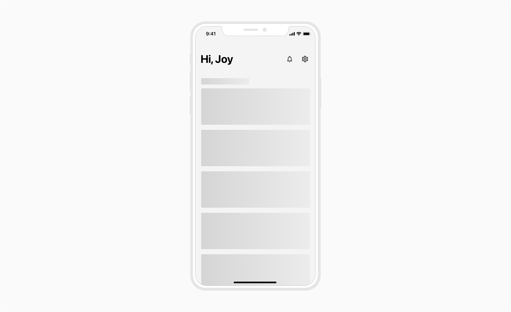
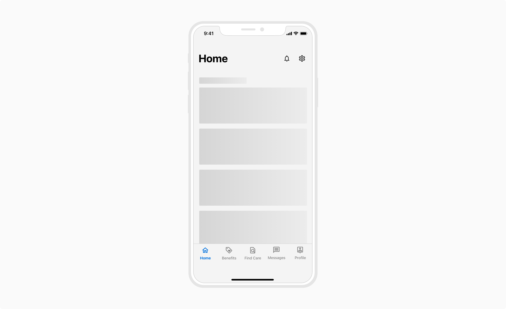

### Level 0 Page
This is the root-level page of a mobile app.
#### Default Page
Such a page consists of a header at the top followed by the content in the body. The header consists of big and bold typography along with optional actions. This type of page is ideal when there is only 1 screen at the L0 level.

 

#### Page with primary navigation
Such pages generally have a header at the top and primary navigation tabs at the bottom. This type of page is ideal when there multiple screens at the L0 level.

 

### Level 1 Pages
#### Non-Modal Pages
Non-modal pages are those which the users cannot dismiss or cancel. They can only navigate back through the previous levels up until the root page following the LIFO (Last In First Out) approach. Hence, these **should not** be used for workflows such as Create, Update/Edit, and Delete.

**A rule of thumb to recognize non-modal pages** - No matter how deep the users are in the pages (or levels), if they should not be allowed to dismiss from there to return to the root level then the non-modal pages are used.

The **Back button (←)** present at the top left is used to navigate back through the stack/levels.

##### Properties
<table style="width: 100%">
  <tbody>
    <tr>
      <th style="width:33%; text-align: left;">Property</th>
      <th style="width:33%; text-align: left;">Value(s)</th>
      <th style="width:33%; text-align: left;">Default value</th>
    </tr>
    <tr style="vertical-align: top">
      <td>Action</td>
      <td>Back button</td>
      <td>-</td>
    </tr>
    <tr style="vertical-align: top">
      <td>Background color</td>
      <td>stone-lightest</td>
      <td>-</td>
    </tr>
    <tr style="vertical-align: top">
      <td>Page transition</td>
      <td>Slide-in(left to right)</td>
      <td>-</td>
    </tr>
  </tbody>
</table>
 

##### Transitions
**Navigating deep in the pages/levels**
<table style="width: 100%">
  <tbody>
    <tr style="vertical-align: top">
      <td>Interaction</td>
      <td>Slide-in(right to left)</td>
    </tr>
    <tr style="vertical-align: top">
      <td>Style of motion</td>
      <td>Expressive motion</td>
    </tr>
    <tr style="vertical-align: top">
      <td>Easing</td>
      <td>Entrance easing</td>
    </tr>
    <tr style="vertical-align: top">
      <td>Curve</td>
      <td>cubic-bezier(0,0,0.3,1)</td>
    </tr>
    <tr style="vertical-align: top">
      <td>Duration</td>
      <td>240ms</td>
    </tr>
  </tbody>
</table>
 

**Navigating back through the stacks/levels**
<table style="width: 100%">
  <tbody>
    <tr style="vertical-align: top">
      <td>Interaction</td>
      <td>Slide-out(left to right)</td>
    </tr>
    <tr style="vertical-align: top">
      <td>Style of motion</td>
      <td>Expressive motion</td>
    </tr>
    <tr style="vertical-align: top">
      <td>Easing</td>
      <td>Exit easing</td>
    </tr>
    <tr style="vertical-align: top">
      <td>Curve</td>
      <td>cubic-bezier(0.4, 0.14, 1, 1)</td>
    </tr>
    <tr style="vertical-align: top">
      <td>Duration</td>
      <td>240ms</td>
    </tr>
  </tbody>
</table>
 

 
