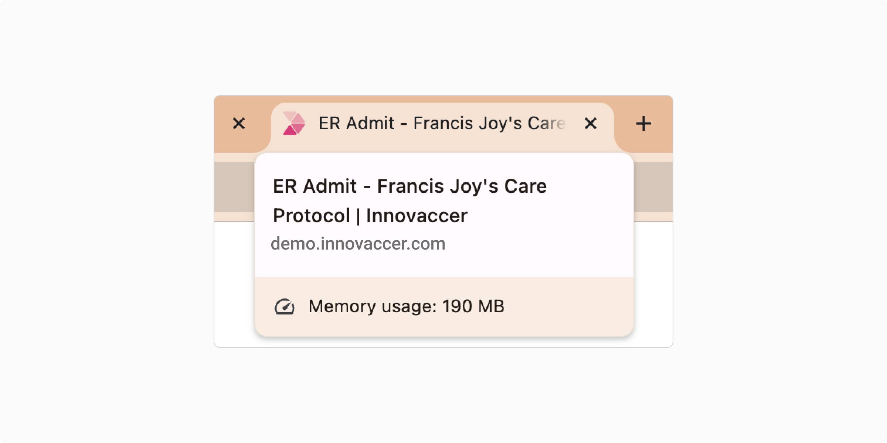
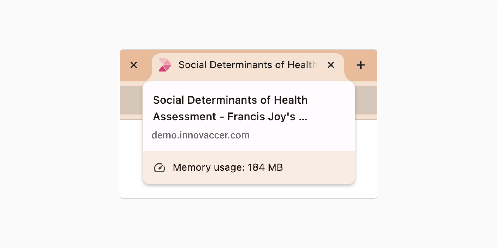
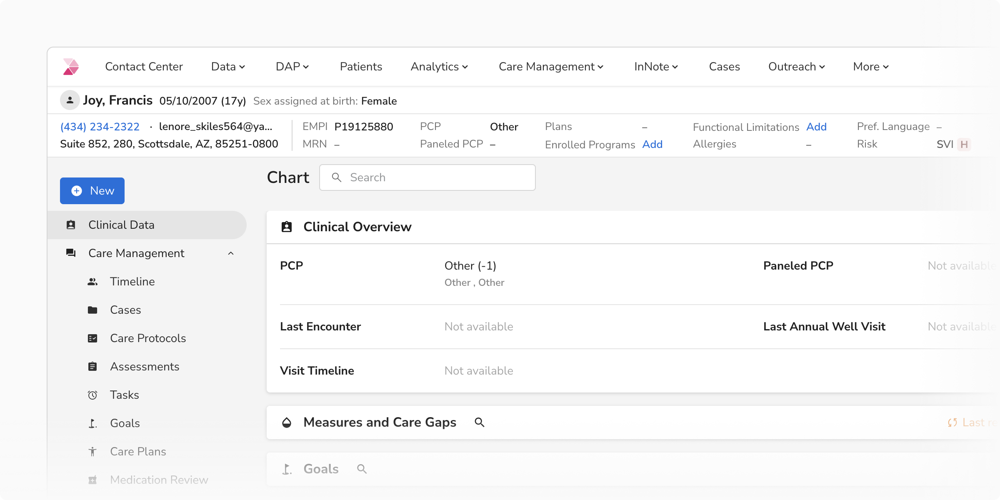
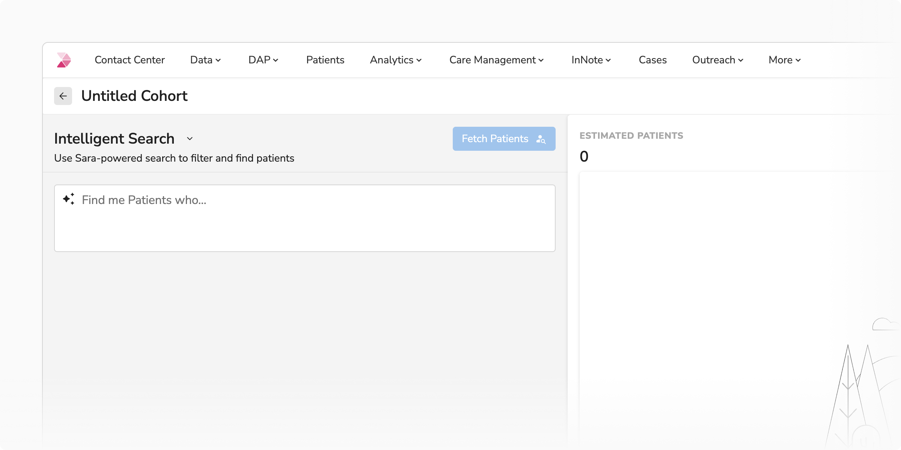
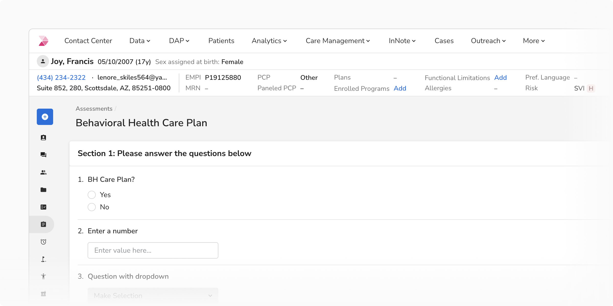
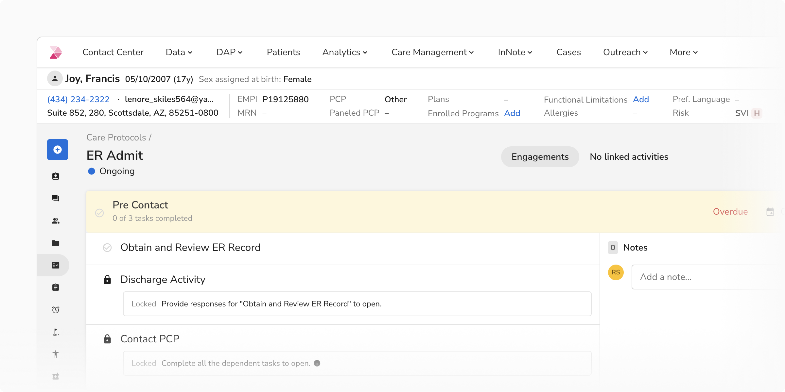
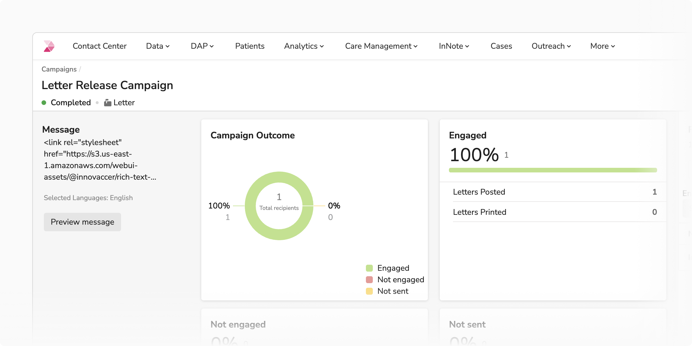
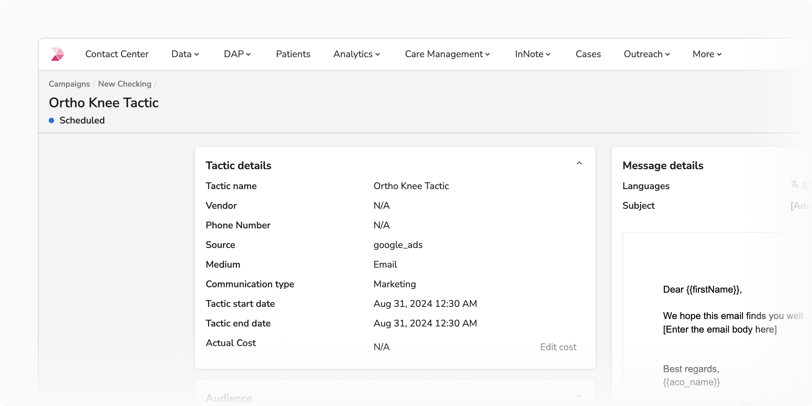
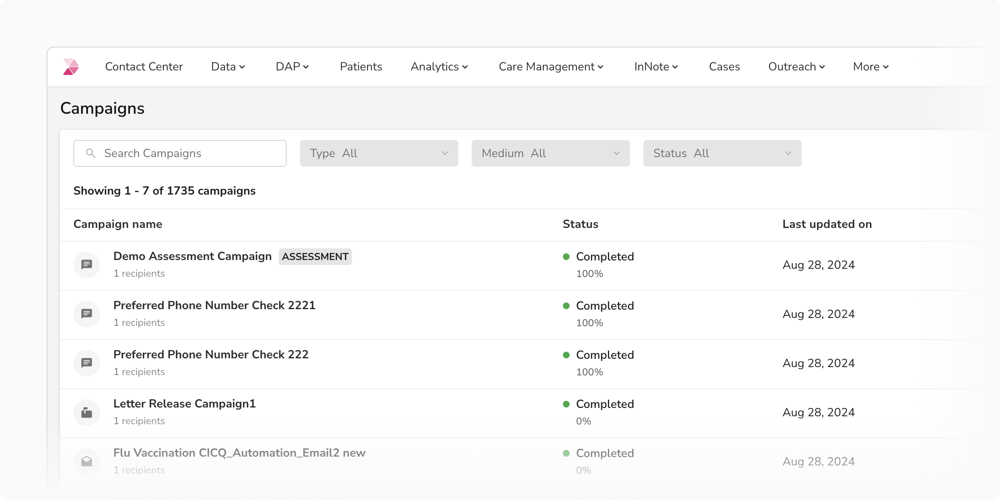

A browser tab title is the text displayed in a browser tab to describe the webpage's content, helping users navigate between multiple tabs.

The title should be descriptive, concise, and contextually relevant to the content or functionality of the page. 

<Caption>An example of browser tab title and the popover while hovering over it</Caption>

### Structure

The tab title should follow the below mentioned structure: 

**[Most Relevant Information] - [Contextual Details] | Innovaccer**

<ul>
  <li>**[Most Relevant Information]:** Most specific and relevant details, such as the page name, the action being taken, the document title, the item being viewed (e.g., a document, patient profile, or project name), or any actionable insights.</li>
  <li>**[Contextual Details]:** Supporting context, such as the section, feature, or step, if applicable, to help the user understand their position within the broader application.</li>
  <li>**| Innovaccer:** Always append the brand name at the end to maintain consistency and brand recognition. It is acceptable to white-label the brand name if necessary.</li>
</ul>

**Note:** By default, the app name will be shown along with the brand name.

For example: Care Management | Innovaccer

<Caption>Structure of browser tab title</Caption>

### Usage

#### Title Length & Overflow

Keep titles concise and informative, aiming for 35-45 characters. Most browsers truncate or show ellipses (...) after 50-60 characters.

<Caption>An example of truncation of overflowing browser tab title</Caption>

 
 

#### Best Practices

Page titles should:

<ul>
  <li>Present the most important or specific information first.</li>
  <li>Be concise, easy to read, and understand.</li>
  <li>Clearly represent the content or purpose of the page.</li>
</ul>

<Caption>Browser Tab Title: Clinical Data - Francis Joy | Innovaccer</Caption>

 
 

#### Examples

<ol>
  <li>
    <b>Ensure that the most relevant information dynamically updates to reflect the current state.</b>

    
    <Caption>Browser Tab Title: Untitled Cohort - Cohort Builder | Innovaccer</Caption>
  </li>

   
   

  <li>
    <b>Consider what the user is likely to prioritize when scanning through multiple tabs.</b>

    
    <Caption>Browser Tab Title: Behavioral Health Care Plan - Francis Joy’s Assessments | Innovaccer</Caption>
  </li>

   
   

  <li>
    <b>Include contextual information to help the user understand where they are within the broader application.</b>

    
    <Caption>Browser Tab Title: ER Admit - Francis Joy’s Care Protocols  | Innovaccer</Caption>
  </li>

   
   

  <li>
    <b>Reflect the user’s position within the application hierarchy moving from specific to general.</b>

    
    <Caption>Browser Tab Title: Letter Release Campaign - Campaigns | Innovaccer</Caption>
  </li>
</ol>

 
 

#### Simplified Browser History Navigation

A structured browser tab title makes it easier to identify and navigate through previously visited pages in the browser history.

#### Avoid Unnecessary Context

If the main information in the tab title clearly conveys the page's purpose, avoid adding contextual information. The goal is to keep the title concise and focused.

<Caption>Browser Tab Title: Ortho Knee Tactic | Innovaccer</Caption>

 
 

#### White Labeling

Browser tab title can be white labeled if needed. 

<b>Example:</b> Campaigns | Customer name

<Caption>Campaigns | Customer name</Caption>
