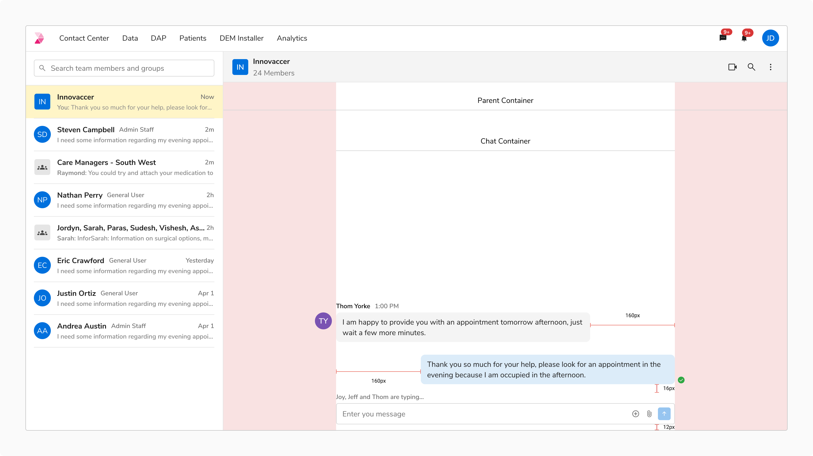

Conversation framework helps in fluid exchange of information.

#### Responsive Breakpoints for Chat Container and Bubble

These are the defined breakpoints for three different parent container sizes:

<table style={{width: "100%"}}>
  <tbody>
    <tr>
      <th style={{width:"20%",  textAlign: "left"}}>Parent Container</th>
      <th style={{width:"20%",  textAlign: "left"}}>Chat Container</th>
      <th style={{width:"20%",  textAlign: "left"}}>Chat Bubble   (Without Media)</th>
      <th style={{width:"20%",  textAlign: "left"}}>Spacing between outgoing and incoming bubbles</th>
      <th style={{width:"20%",  textAlign: "left"}}>Spacing between same bubbles</th>
    </tr>
    <tr style={{verticalAlign: "top"}}>
      <td>Up to 480px</td>
      <td>12px left- right padding from parent container</td>
      <td>84px spacing from chat container edges</td>
      <td>16px</td>
      <td>8px</td>
    </tr>
    <tr style={{verticalAlign: "top"}}>
      <td>481px-768px</td>
      <td>56px left-right padding from parent container</td>
      <td>160px spacing from chat container edges</td>
      <td>24px</td>
      <td>8px</td>
    </tr>
    <tr style={{verticalAlign: "top"}}>
      <td>769px and above</td>
      <td>Fixed at 640px, center aligned</td>
      <td>160px spacing from chat container edges</td>
      <td>24px</td>
      <td>8px</td>
    </tr>
  </tbody>
</table>

 

##### Up to 480px

<Caption>Up to 480px</Caption>

##### 480px-768px

<Caption>480px-768px</Caption>

##### 769px and above

<Caption>769px and above</Caption>

#### Working with Chat Input

##### With and Without Typing Indicator

![With typing indicator [Left], Without Typing Indicator [Right]](./images/typing-indicator.png)
<Caption>With typing indicator [Left], Without Typing Indicator [Right]</Caption>

##### Overflow behavior

In case of numerous chat bubbles, scrolling down moves content beneath the chat input, with a gradient overlay ensuring a smooth transition and indicating hidden content.

<Caption>Overflow behavior</Caption>

#### Working with Chat Separators

##### Chat Separator - Date

<Caption>Chat Separator - Date</Caption>

##### Chat Separator - Unread Messages

<Caption>Chat Separator - Unread Messages</Caption>

##### Chat Separator - New Messages

<Caption>Chat Separator - New Messages</Caption>

<Caption>Chat Separator - New Messages</Caption>

