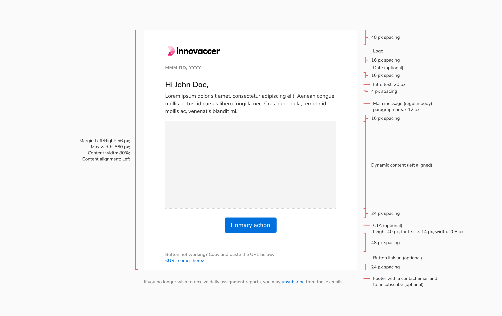
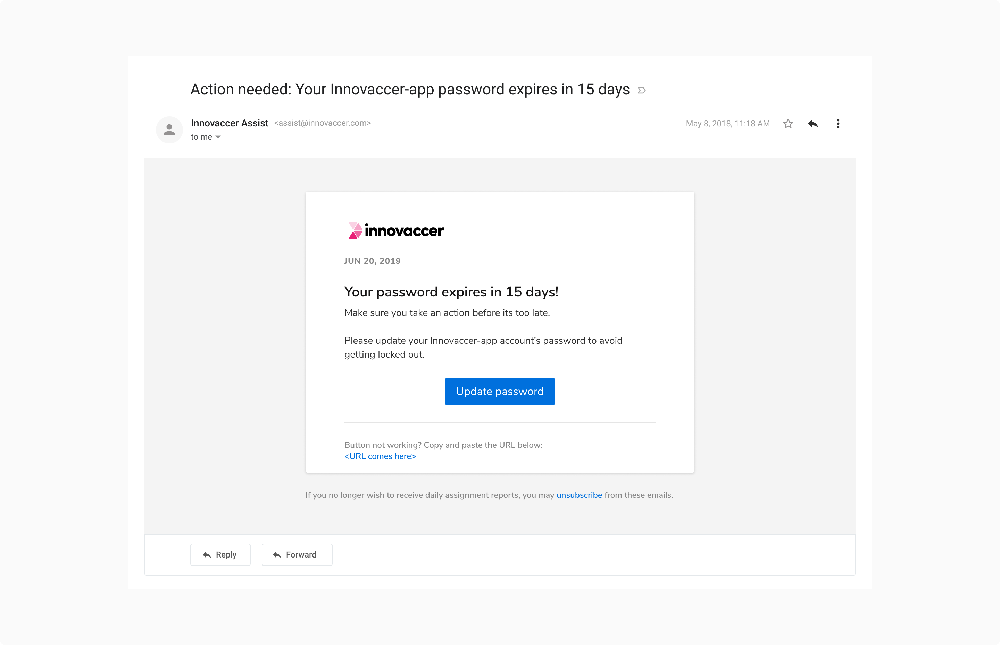
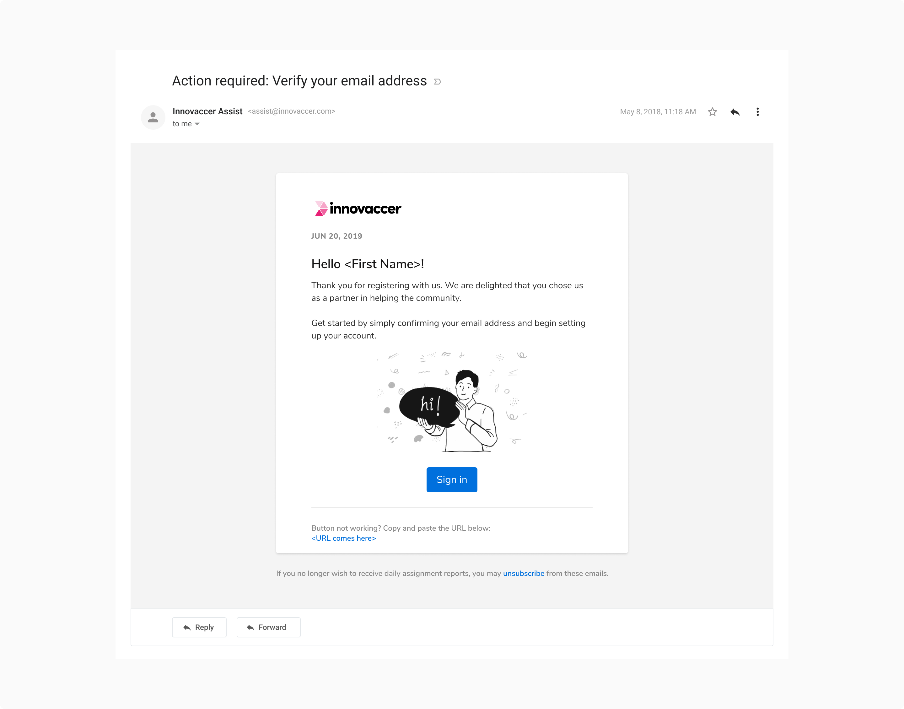
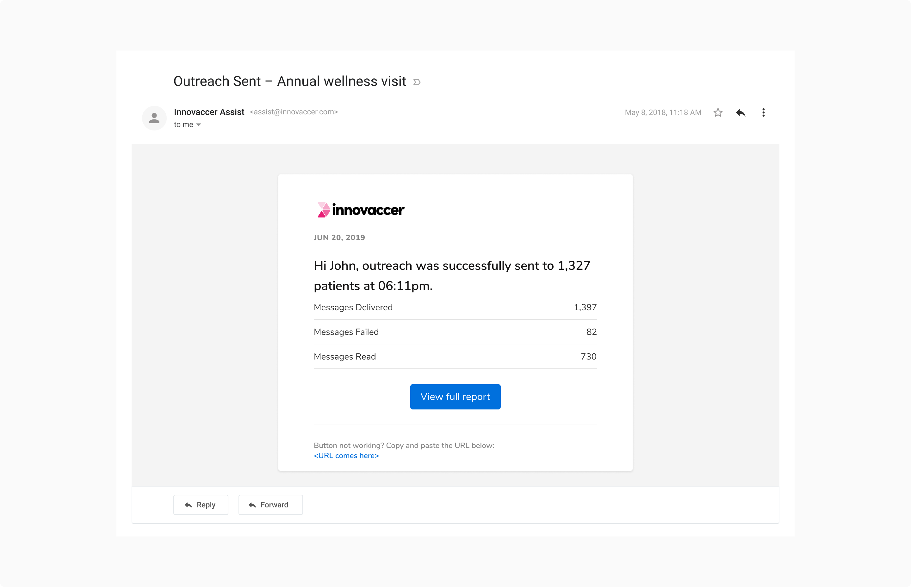

### Structure

 
 

 
 

### Usage
 

#### Dynamic content
The body of email can be composed of text, images or more. For e.g.  Button, list, etc.

<Caption> The body of email composed of text </Caption>

 
 

<Caption> The body of email composed of text with images </Caption>

 
 

<Caption> The body of email composed of text with list</Caption>
