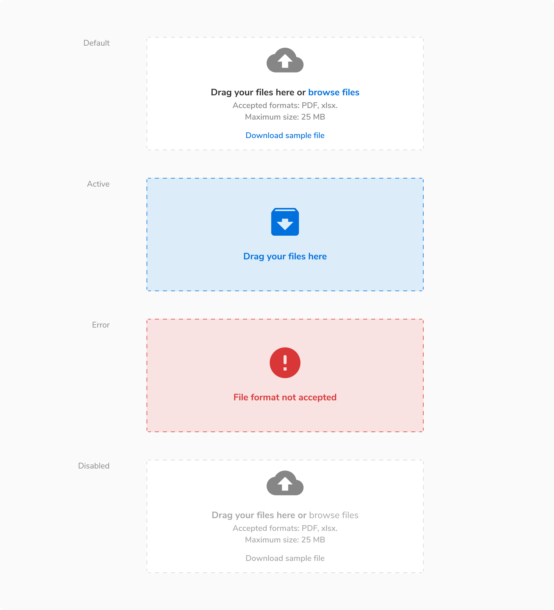
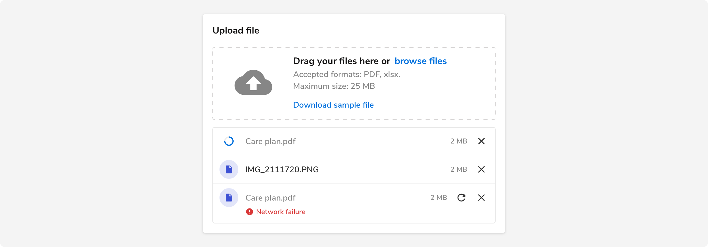
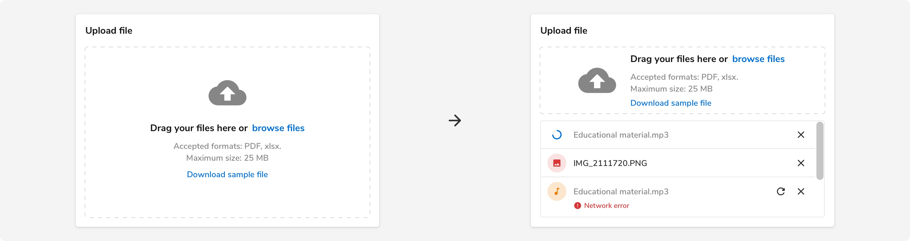
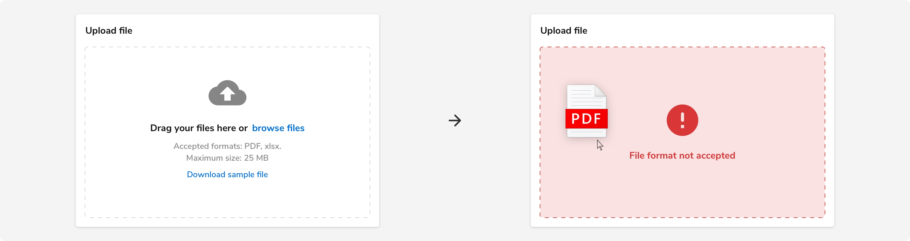
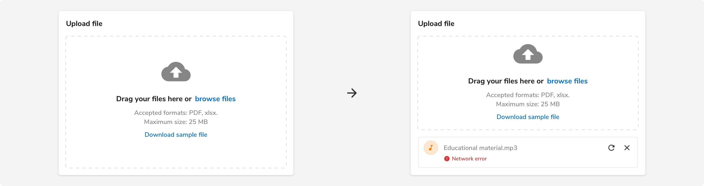
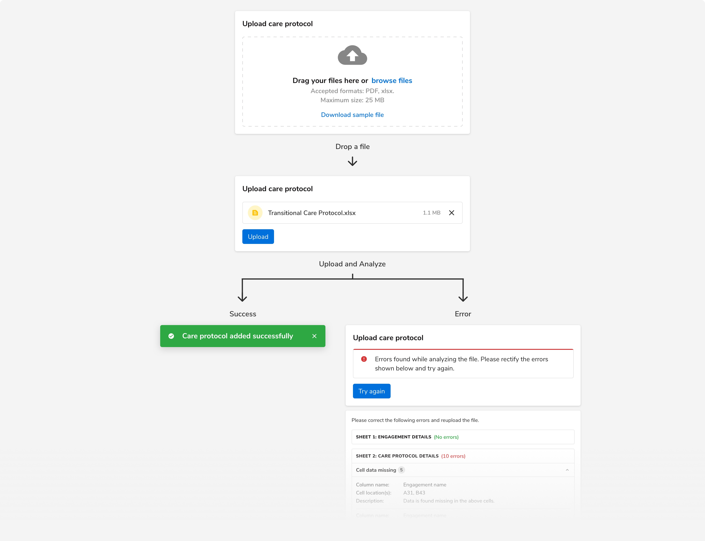
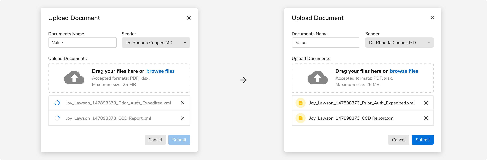
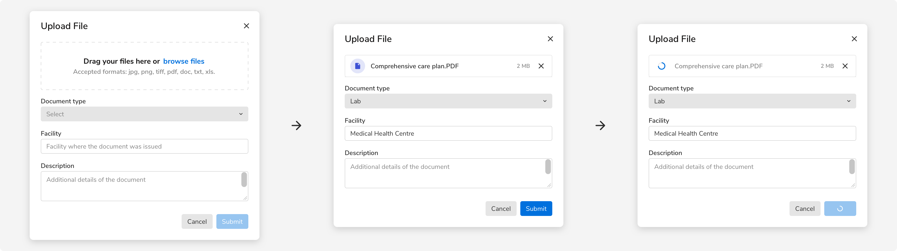

File uploader is the component that can be used to upload file(s) in your application. It consists of the conventional drag and drop method.

### Structure
File uploader can be composed using two components - dropzone and file list. As the name suggests, dropzone is the area where the users can drop file(s) to upload whereas file list is a list of the files that have been dropped at the drop zone. These files can be in different states - uploaded, in progress, etc.
<Preview name="components-dropzone-all--all" />

### Sizes
Dropzone component comes in **3 sizes** basis on the space available.

#### Standard
This size should be used in cases when there are no constraints in the space available.

 
 

#### Compressed
This size should be used when the height available is not sufficient to use the standard size.

 
 

#### Tight
This size should be used when the height and width available is not sufficient to use neither the standard size nor the compressed size.

 
 

### States
Dropzone component comes in **4 states** - default, active, error and disabled.

 
 

### Usage
 

#### Uploading to the server
Basis on the requirement, file uploader can either -
- Upload the file directly to the server the moment a user picks/drops a file **OR**
- Upload the file only when an Upload, Submit, or similar action is triggered by the user.

It is suggested to use the latter so as to minimize the resource load (network calls).

#### Status of file uploading
To show the status of a file being uploaded, a file uploader item is used which contains information such as the file name, upload progress, any error, etc. Progress ring is used to indicate the progress.

**Note**: A list of file uploader items is shown using the Flat (No shadow) card component.
 

#### Responsiveness
Using the standard drag and drop file uploader when there is no option to adjust the height dynamically converts it to the compressed variant as shown in the example. 

Here the height of the card remains the same and it can accommodate a maximum of 3 file uploader items before scrolling occurs.

 
 

#### Errors
##### Before dropping files
File uploader provides the option to indicate that a file format is not accepted or the file size exceeds the limit through different visual cues.

**Note**: Users can still drop the file. In that case, a file uploader item will be used to show the error as illustrated in the next section.

 
 

##### While uploading
File uploader also provides the option to indicate that there was an error while uploading the file. These types of errors are shown using the file uploader item.

 
 

#### File processing required
File uploader is a simple component and it does not involve processing or analyzing file(s) as a part of it. But there can be cases when you need to process or analyze the uploaded file to check whether the content of the file matches your requirement(s).

If the case arises, always process or analyze the file after an Upload, Submit, or similar action has been triggered by the users.

 
 

#### File uploader in a form
The state of the submit button in a form depends on whether the file will be uploaded right away on the server or if it will be uploaded after the users click on submit.

1. If the file has been uploaded to the server already then the submit button becomes enabled only when the file has been uploaded successfully.

 
 

2. If the file has not been uploaded to the server already then the submit button acts as the trigger to upload the files to the server.

 
 