Multiple components such as text inputs, radio, dropdown, etc. can be combined to create forms to intake information from the users.

### Structure

Form consists of various fields such as inputs, dropdowns, etc. and the actions to submit the form. The width of each field should be determined based on the no. of columns that are to be used in the form.

While using a multi-column form, make sure that the fields that are placed adjacent to each other are relatable enough so that the users don’t get confused as to which field should be filled first. (e.g. First name & Last name)

<Caption>Structure of a form</Caption>

### Types
Forms can come in various types such as -

#### Single step forms
These are the most basic forms that can be completed in a single step. Clicking the primary action submits the form.

<Caption>A single step form</Caption>

#### Multi-step forms

##### Two steps
Instead of using a stepper for two step forms, it is recommended to have a way to go back to the previous step such as a back button in the header or a ‘Previous’ button in the footer.

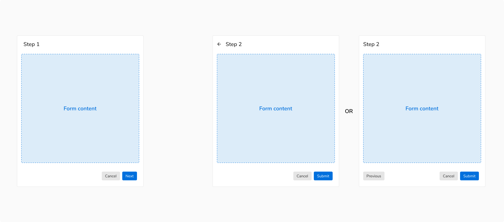
<Caption>A two step form</Caption>

##### More than two steps
Multi step forms generally have three or more steps. These forms should be created using [Steppers](/components/steppers/usage/).

Actions in such forms: 
<ul>
  <li>Each step should have a primary action saying “Next” and the last step should have a primary action to submit the form.</li>
  <li>Each step should have a “Previous” action to navigate to the previous steps.</li>
  <li>“Cancel” or “Discard” button discards all the changes irrespective of the current step.</li>
</ul>

 

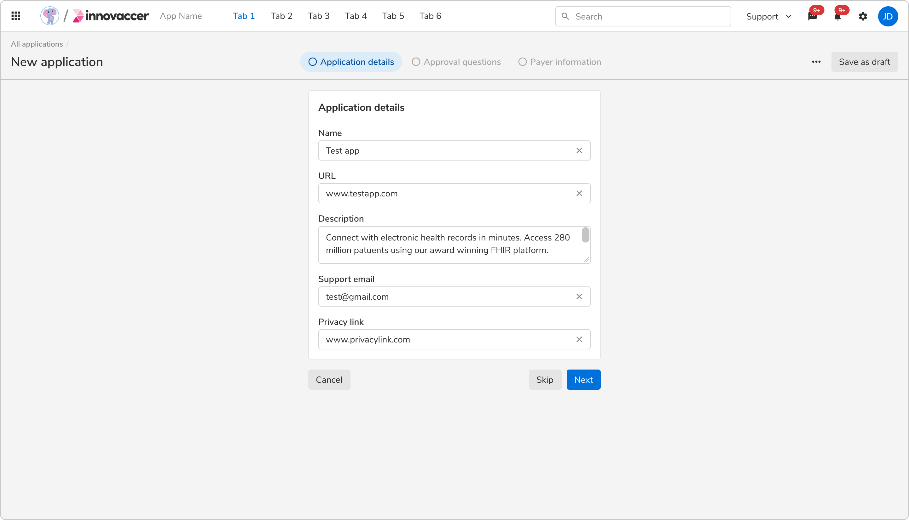
<Caption>A multi step form</Caption>

### Usage

#### Layout of the form fields
Form fields can be aligned in various ways depending upon the space available.

##### Vertical
In such arrangement, the label appears on top of the form field, making it ideal to use when there is a lot of vertical space available. Forms aligned vertically are easy to scan.

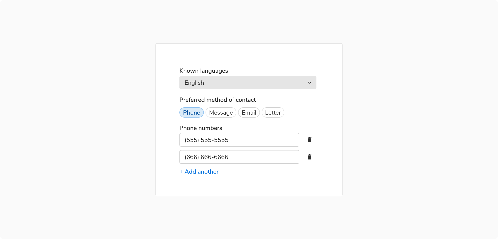
<Caption>Vertical arrangement of form fields</Caption>

##### Horizontal
In such arrangement, the label is on the left of the form field, making it ideal to use when there is a lot of horizontal space available.

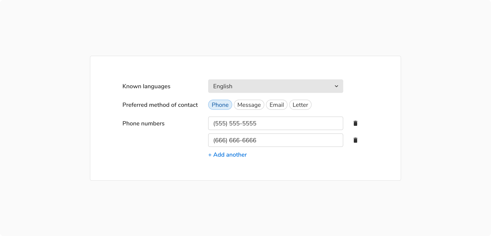
<Caption>Horizontal arrangement of form fields</Caption>

##### Inline
In these forms, inputs fields are horizontally stacked in order to save vertical space.

<Caption>Inline arrangement of form fields</Caption>

#### Position and order of actions
Number of actions in a form should be limited i.e. 2 or 3 at max. If there is a requirement of tertiary action right where the primary and secondary actions are, consider using the transparent button.

Primary actions should be disabled until all of the required fields have been filled. A tooltip showing appropriate text should appear while hovering over that disabled action.

##### Modals
Actions should be displayed at the bottom right of the modal because users scan short forms in Z-pattern. The primary action must be the rightmost action and other actions on its left (if any).

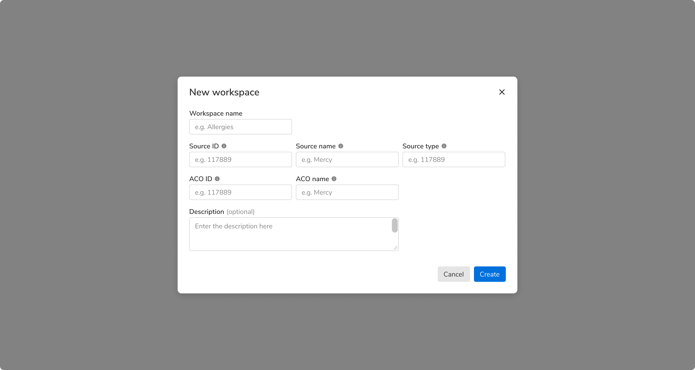
<Caption>Form in a modal</Caption>

##### Sidesheets
Actions should be displayed at the left of the sidesheet because users scan long forms in F-pattern. The primary action must be the leftmost action followed by other actions(if any).

<Text weight='strong'>Example 1</Text>

 

Content here takes space that is greater than approx 75% of the height. Hence, the actions should be at the bottom of the sidesheet (in footer).

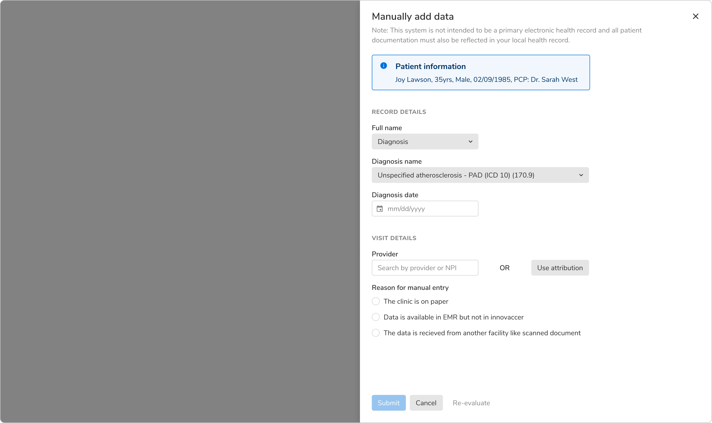
<Caption>When content takes more than 75% of the height</Caption>

<Text weight='strong'>Example 2</Text>

 

Content here takes space that is less than 75% of the height. Hence, the actions should appear just below the last field.

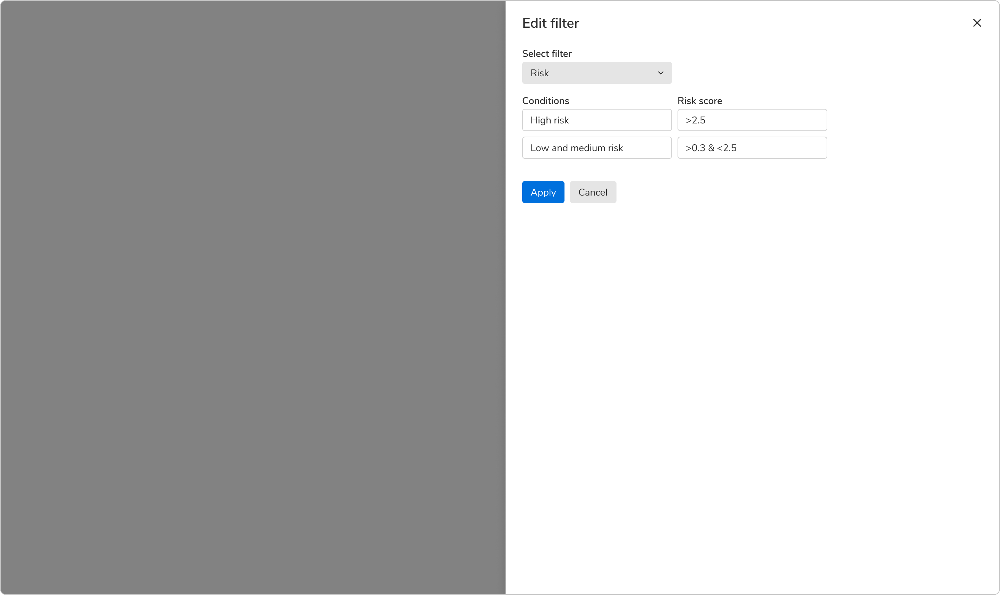
<Caption>When content takes less than 75% of the height</Caption>

##### In page forms
In a page-long form, users scans through F pattern, hence the actions should be on the bottom left. Primary action would be the leftmost action followed by other actions (if any). One can use inline labels as well, because plenty of vertical space is available.

**Note:** It is recommended to use large size of buttons in the case of such forms.

 

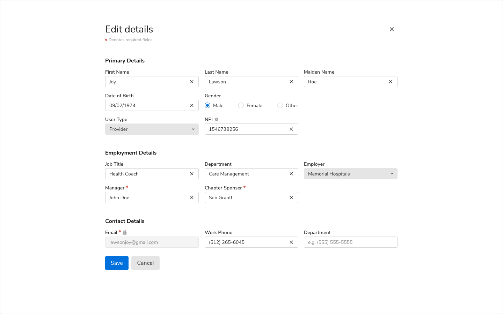
<Caption>Form in a full screen modal</Caption>

#### Required vs. Optional fields
Form fields can be marked as optional or required depending upon the context. To avoid unnecessary clutter, mark only the minority fields as optional or required.

It is recommended to keep the notations of required and optional fields consistent throughout the app as different notations can confuse users.

**When no. of required fields &#60; no. of optional fields**

 

<Caption>Using dot indicator</Caption>

 

**When no. of required fields &#62; no. of optional fields**
 

<Caption>Using “(optional)” tag</Caption>

#### Validation and feedback
Forms can be validated either while typing or after clicking the primary action to submit the form depending upon the field type.

For example: password field while creating an account should be verified while typing whereas password field while signing in to an account can be verified after clicking on primary action.

After validating, proper feedback should be conveyed to the users in order to help understand the problem and how to fix it.

Feedback in a form can be shown in multiple ways. Some of them are:

##### Inline feedback
Errors in form fields are shown using the [Inline message](/components/message/usage/#inline-message-1) component and should be persistent until the error gets resolved. 

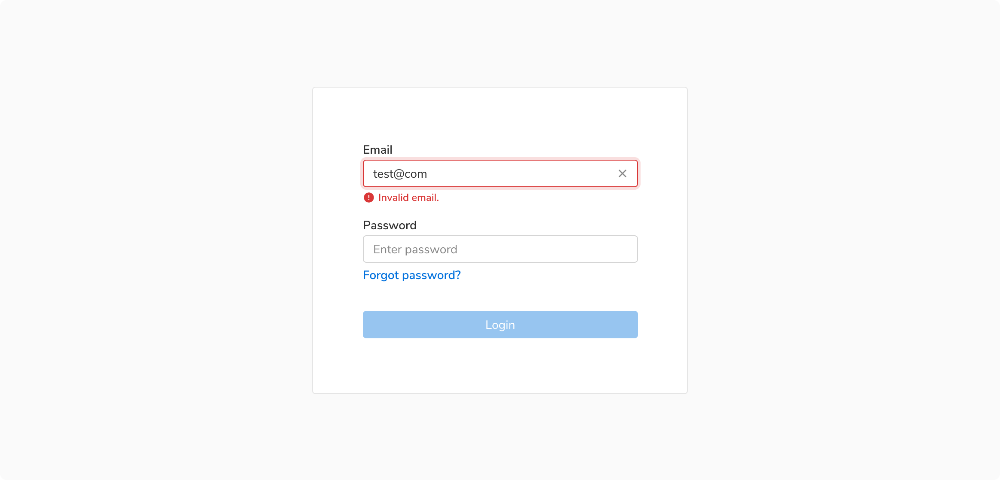
<Caption>Inline feedback for input field</Caption>

##### Collective form feedback
In case of errors in the overall form submission such as required fields are not filled, etc., use a [standard message](/components/message/usage/#standard) component. These kinds of errors generally occur after clicking on the primary action to submit the form. 

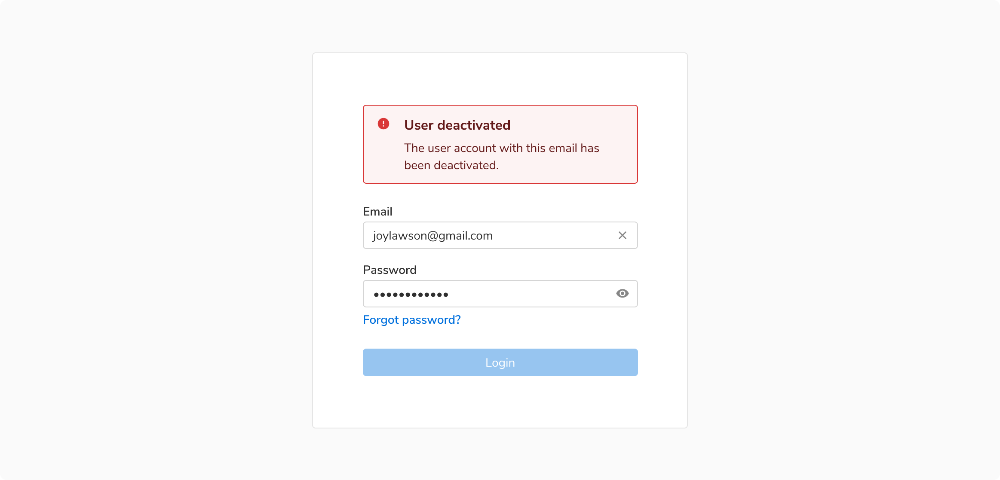
<Caption>Collective form feedback after clicking the “Login” button</Caption>

#### Auto-complete
Users can accept the autocomplete suggestion by pressing the tab key or the right arrow key.

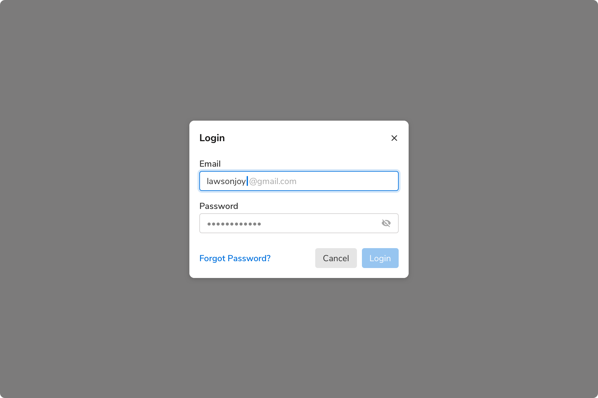
<Caption>An auto-complete field</Caption>

#### Auto-suggestion
Suggestions can be shown in a form just below the input field.

<Caption>An auto-suggestion field</Caption>

#### Auto-saving
Forms data can be auto saved based on an event or a pre defined time interval. In such cases, users should also be given an option to manually save the data. Doing so can be helpful in cases when autosave fails due to some reason.

The status of auto-saving the data should appear just under the heading where the form is being used e.g. just under the title in page header, just under the heading in a modal or a side sheet.

These different statuses can be -

##### Default
Default status is when the user has not made any changes to the form. 

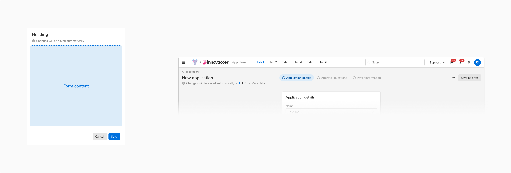
<Caption>Default status of auto-save form in [Left] Modal/Sidesheet vs [Right] Page header</Caption>

##### Saving
This status occurs when the user made changes and there’s background activity in progress to save a draft of these changes. 

<Caption>Saving status of auto-save form in [Left] Modal/Sidesheet vs [Right] Page header</Caption>

##### Saved
Saved status indicates that all the recent changes were saved successfully. 

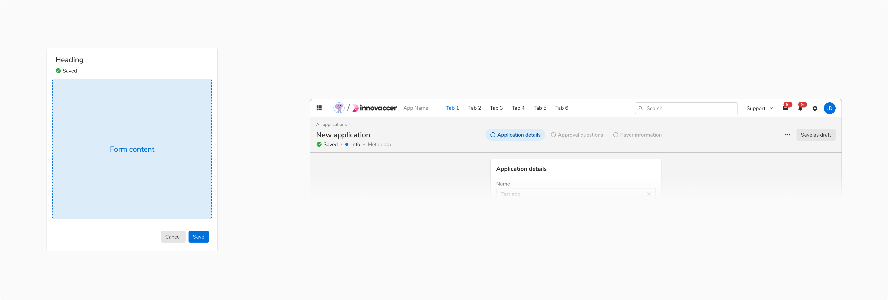
<Caption>Saved status of auto-save form in [Left] Modal/Sidesheet vs [Right] Page header</Caption>

##### Error
Error status occur when the changes fail to auto-save due to some reason. The users are informed about the failure and further attempts to save the data are made. 

The users can also try to save the data manually (hence it is recommended to have an option to manually save the data when auto-save is being used). 

<Caption>Error status of auto-save form in [Left] Modal/Sidesheet vs [Right] Page header</Caption>
