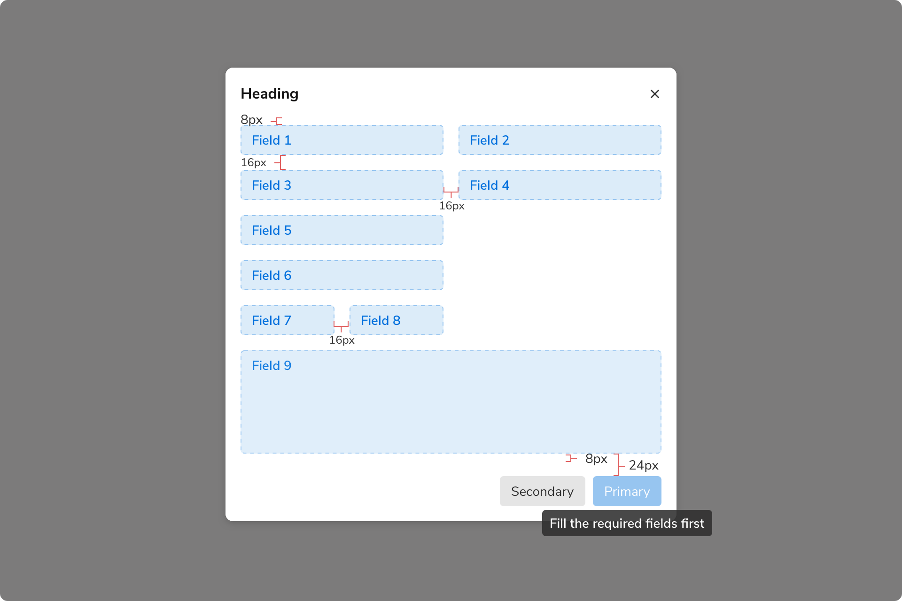
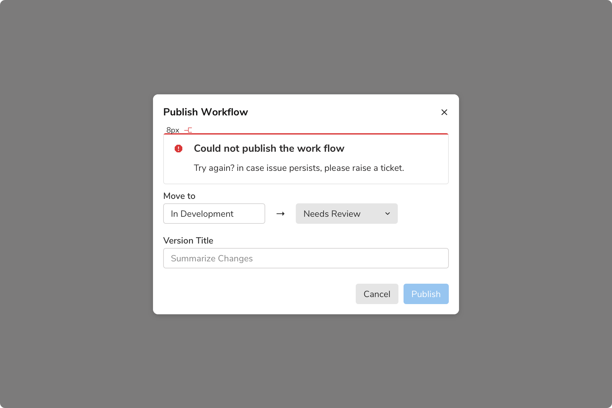
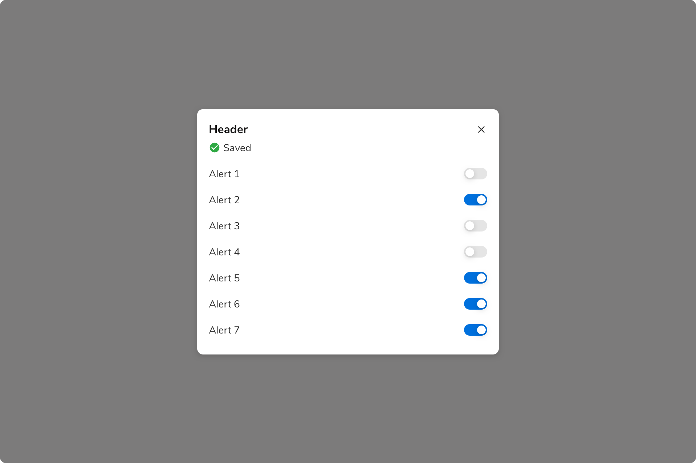
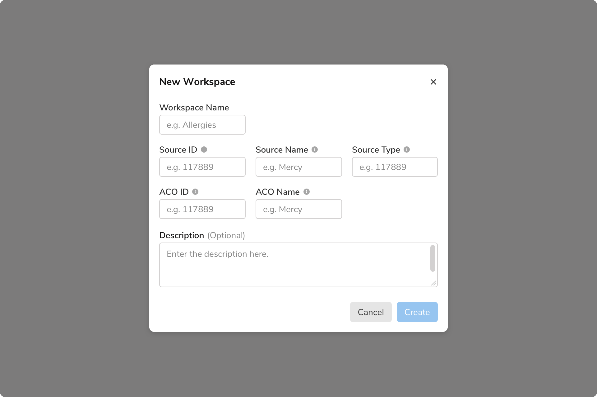
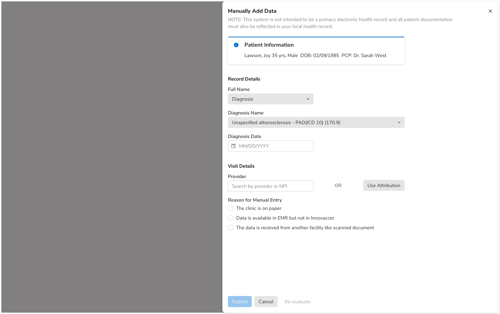
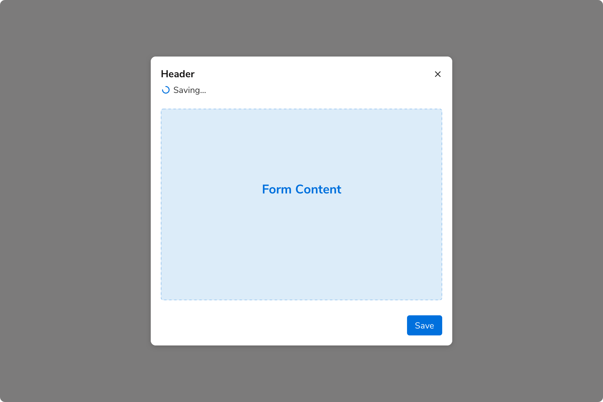
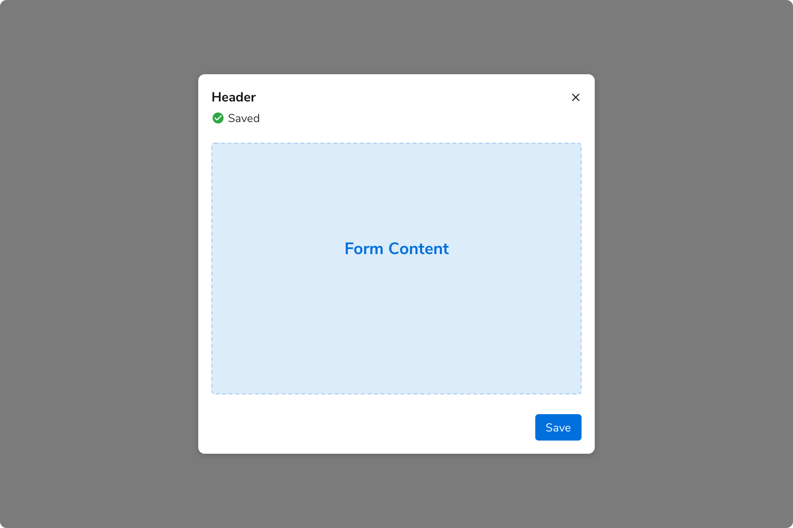
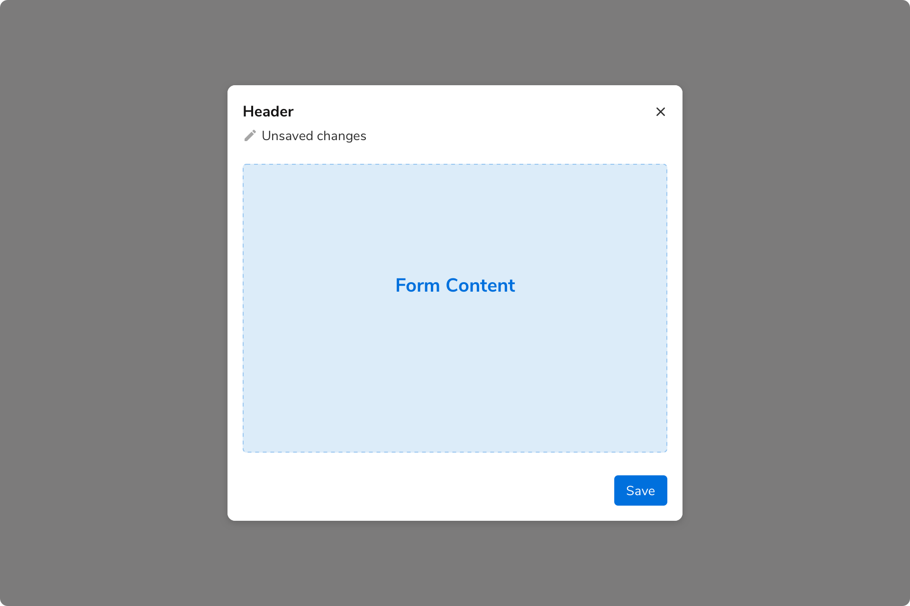
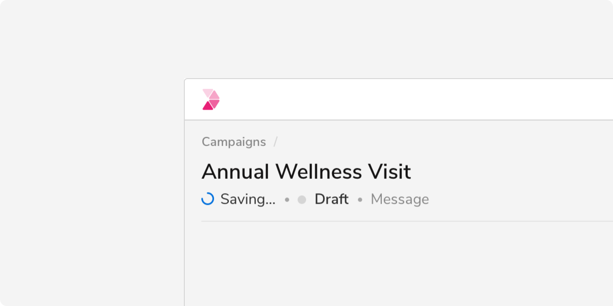

Multiple components such as inputs, radio, buttons, etc. can be combined to create forms to intake information from the users.

### Structure
The width of each field should be determined based on the no. of columns that you would want to use in a form. The example below is showing a two-column form.

If you are using a multi-column form, make sure that the fields that you place adjacent to each other are relatable enough so that the users don’t get confused as to which field should be filled first. (e.g. First Name & Last Name)

#### Actions
Number of actions should be limited i.e. 2 or 3 at max. If there is a requirement of tertiary action right where the primary and secondary actions are, consider using the transparent button.

Primary actions should be disabled until all of the fields have been filled. A tooltip showing appropriate text should appear while hovering over that action.

 
 

### Types
#### Basic forms
These are the forms that can be completed in a single step. Clicking the primary action submits the form.
<Preview name="forms-basic-form" />

#### Multi-step forms
* Forms that can only be completed in more than one step.
* Clicking the primary action button takes to the next step and the primary action on the final step submits the form.
* Each step should have a primary action saying “Next”. And the last step should have a primary action to submit the form.
* Each step should have a “Previous” action to navigate to the previous steps.
* “Cancel” or "Discard" button discards all the changes irrespective of the current step.

<Preview name="forms-stepper-form" />

#### Inline Forms
In these forms, inputs fields are horizontally stacked which can save vertical space.
<Preview name="forms-inline-label-form" />

#### Password Requirements
<Preview name="forms-create-password" />

### Usage
#### Required vs Optional Fields
Inputs can be marked as optional or required depending upon the context. To avoid unnecessary clutter, mark only the minority fields as optional or required.

**When no. of required fields < no. of optional fields**

 

**When no. of required fields > no. of optional fields**

 

It is recommended to keep the notations of required and optional fields consistent throughout the app as different notations can confuse users.
 
#### Validation and Feedback
Form feedback should be shown using the message component only after the users click the primary action.

 
 

#### Using Switches
Switches provide immediate results hence they don’t need any action button to save the response. (Can be used with some auto-saving forms)

 
 

#### Dialogs
Actions should be displayed at the bottom right of the dialog because users scan short forms in Z-pattern. The primary action must be the rightmost action and other actions on its left (if any).

 
 

#### Sidesheets
Actions should be displayed at the left of the sidesheet because users scan long forms in F-pattern. The primary action must be the leftmost action followed by other actions(if any). 

**Example 1**

Content here takes space that is greater than 75% of the height. Hence, the actions should be at the bottom of the sidesheet (in footer).

 
 

**Example 2**

Content here takes space that is less than 75 % of the height. Hence, the actions should appear just below the last field.

 
 

#### In-page forms
In a page-long form, users scans through F pattern, hence the actions should be on the bottom left. Primary action would be the leftmost action followed by other actions (if any). One can use inline labels as well, because plenty of vertical space is available.

**Note**: It is recommended to use large size of buttons in the case of such forms.

 
 

#### Auto-complete
Users can accept the autocomplete suggestion by pressing the tab key or the right arrow key.

 
 

#### Auto-suggestion
Suggestions can be shown in a form just below the input field.

 
 

#### Auto-saving
Forms can be auto-saved. In such cases, users should also be given an option to manually save the data of the form. Doing so can be helpful in cases when autosave fails due to any reason.

There can be 4 states in such forms:

##### No changes made
 

##### Saving

 
 

##### Saved

 
 

##### Unsaved changes

 

These states will appear just under the header where the form is being used (under the header description in case there is one). For example - just below the header of a modal/sidesheet as shown above.

In case the form is being used on an entire page, auto-save can be a part of page header as shown here -

 
 