Layouts can be used to quickly setup and design a page. These are the patterns that are common across web and Innovaccer's products.

### Templates
Following templates are available for use to quickly setup and design a page.

#### Blank template
 
 

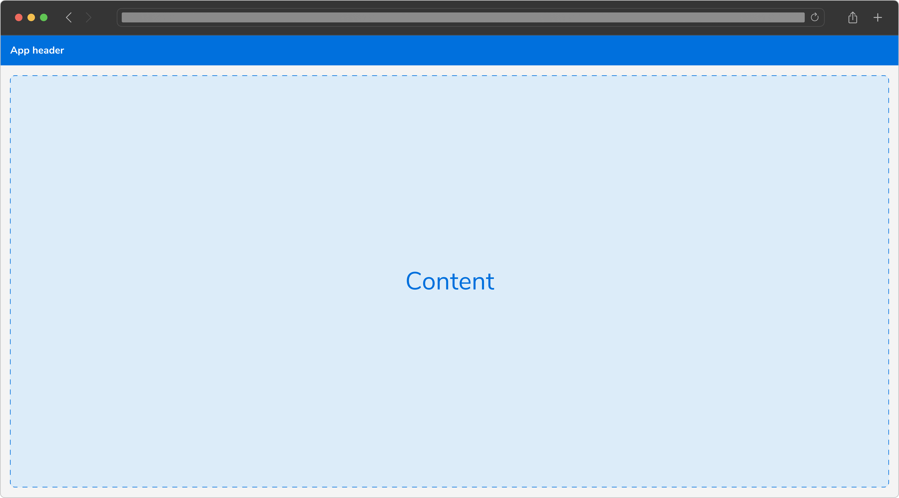
 

**Example**

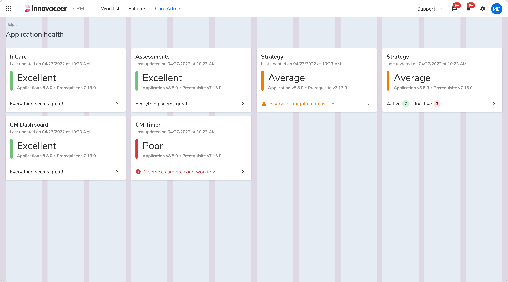
 
 

#### Resource table template
 
 

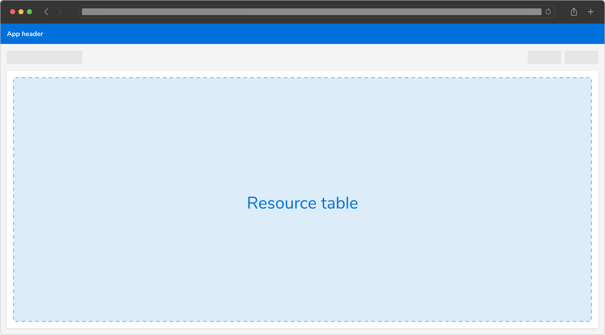
 

**Example**

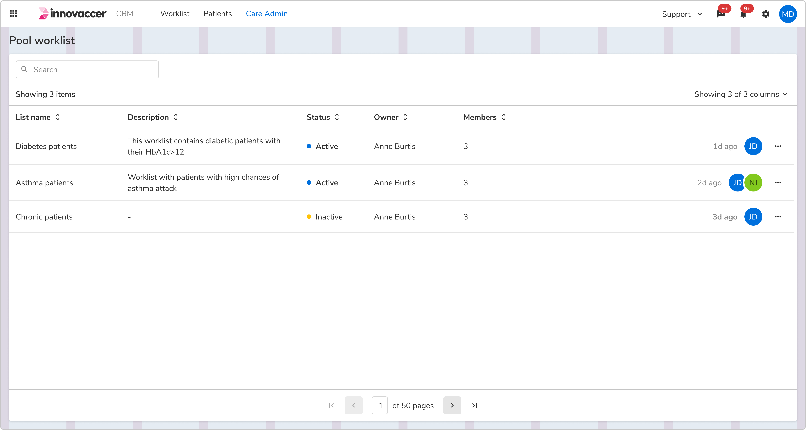
 
 

#### Level 1 header template
 
 

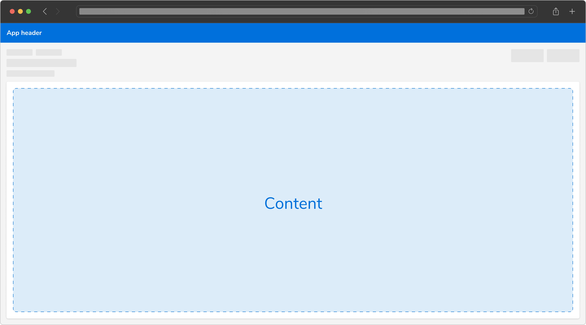
 

**Example**

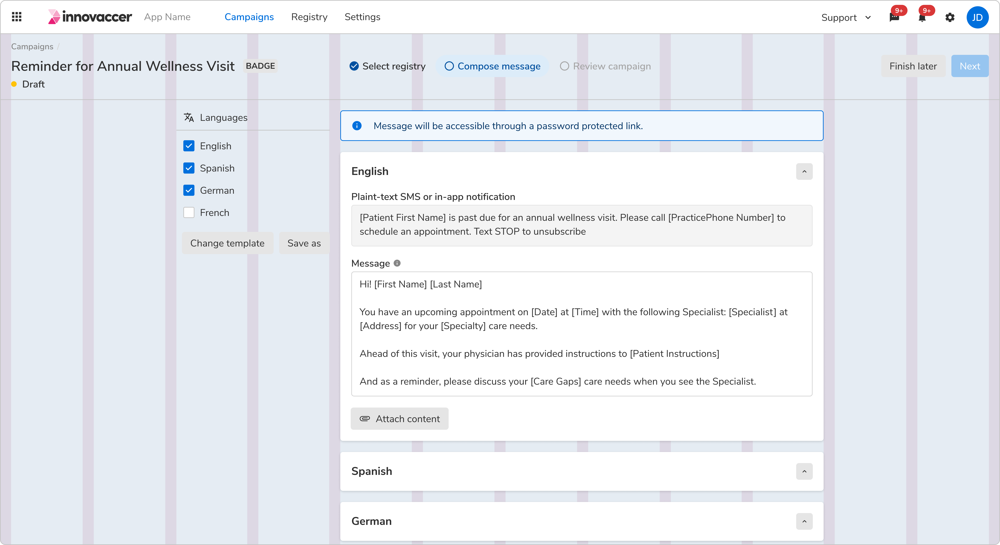
 

**Nested grid**

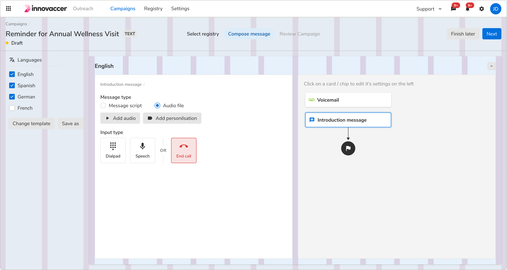
 
 

#### Sidebar template
 
 

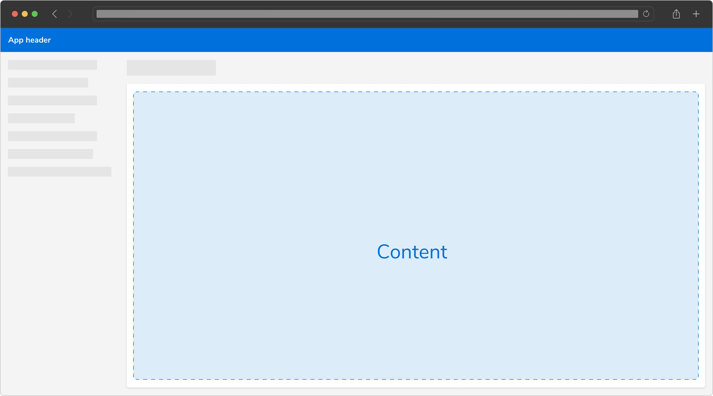
 

**Example**

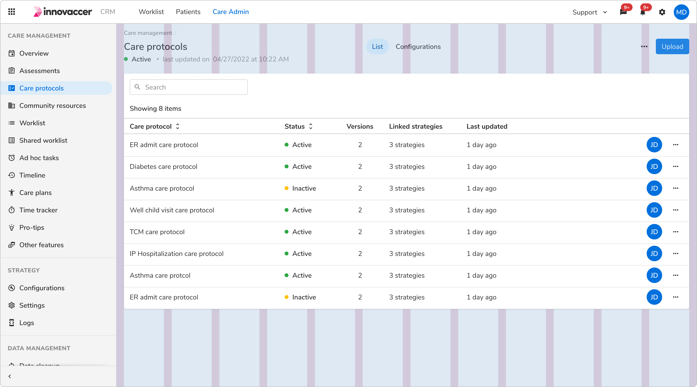
 
 

#### Patient bar template
 
 

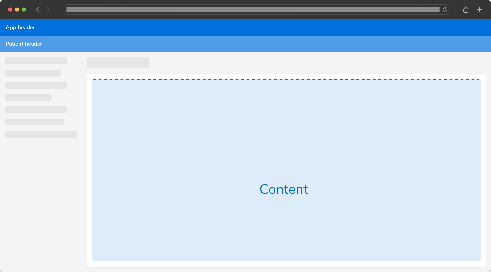
 

**Example**

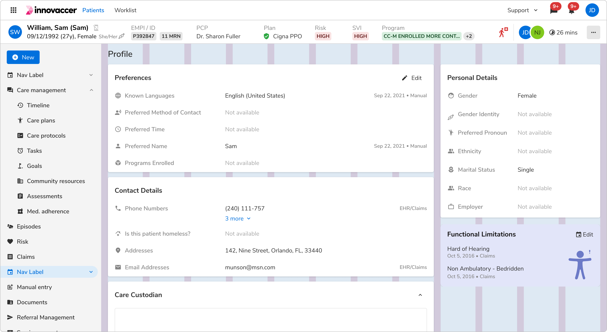
 
 

#### Mini sidebar template
 
 

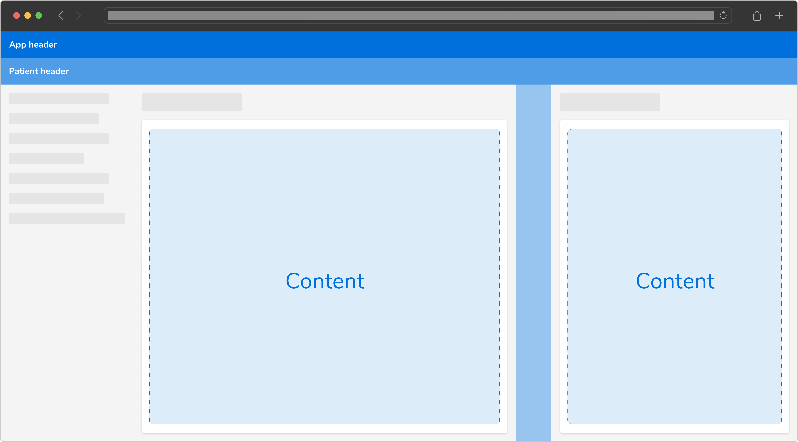
 

**Example**

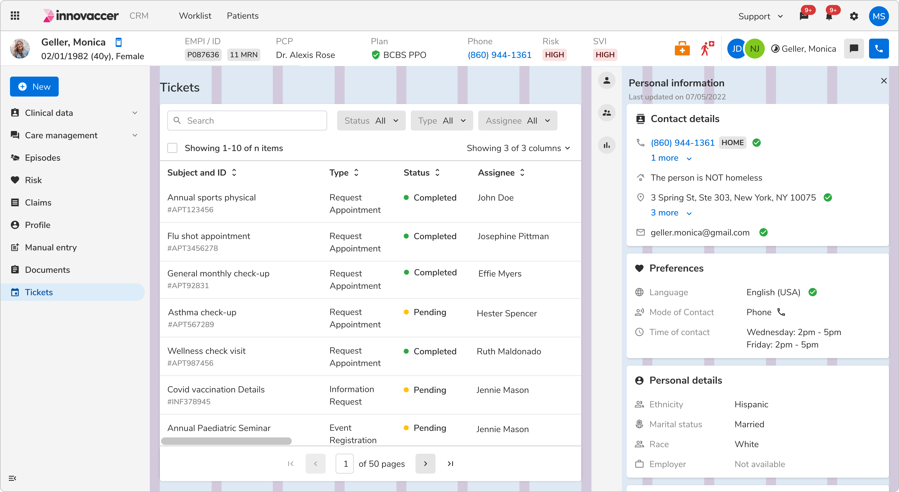
 
 

#### Settings template
 
 

 

**Example**

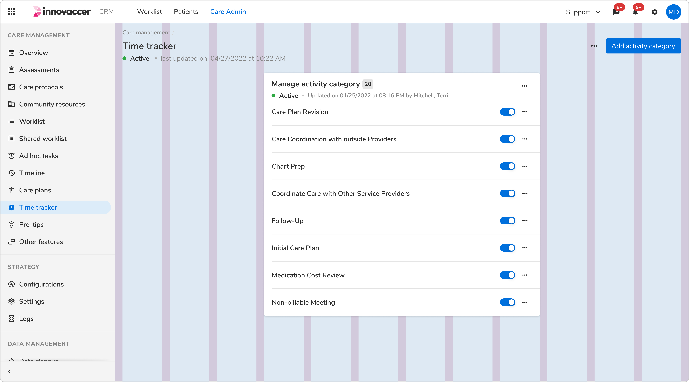
 
 