Layouts can be used to quickly setup and design a page. These are the patterns that are common across web and Innovaccer's products.

### Templates
Following templates are available for use to quickly setup and design a page.

#### Blank template

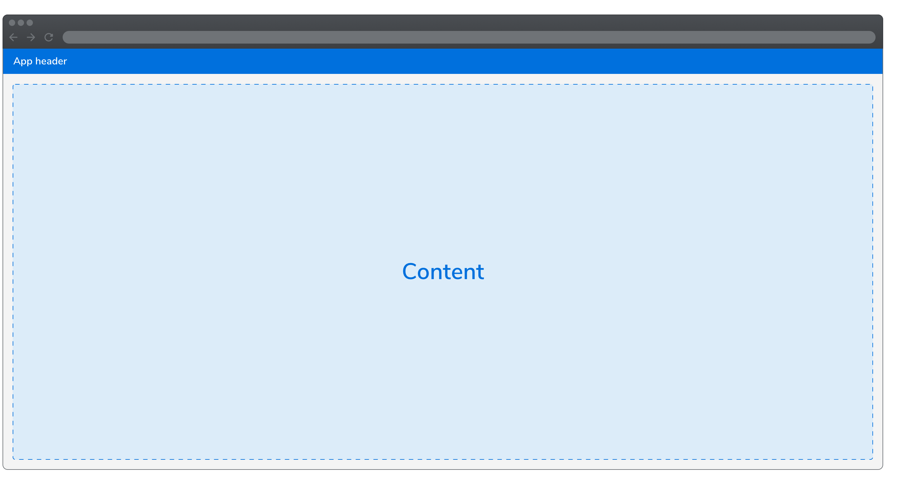
 

**Example**

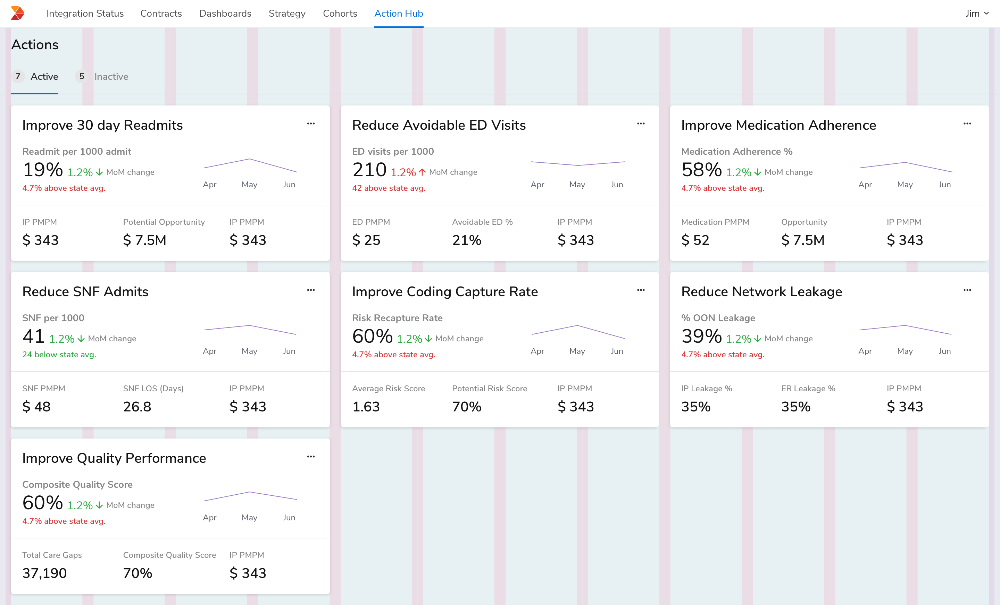
 
 

#### Resource table template

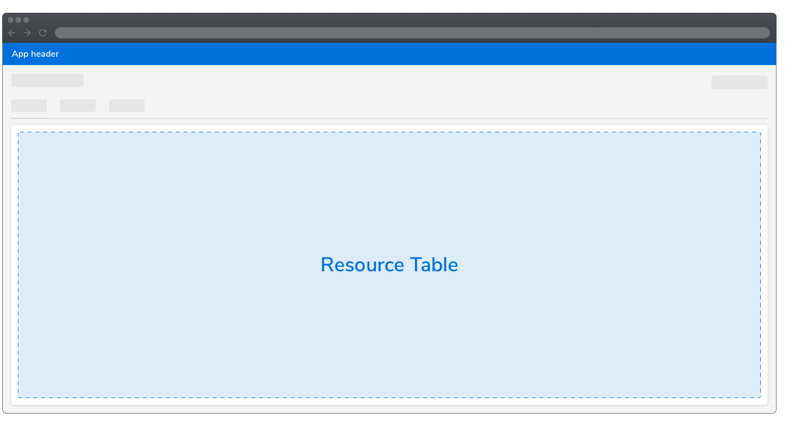
 

**Example**

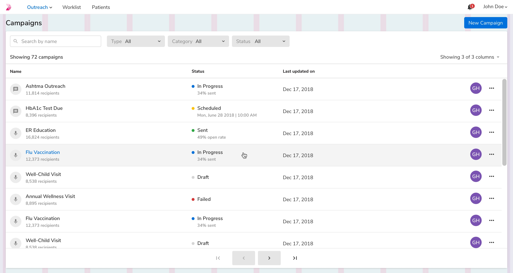
 
 

#### Level 1 header template

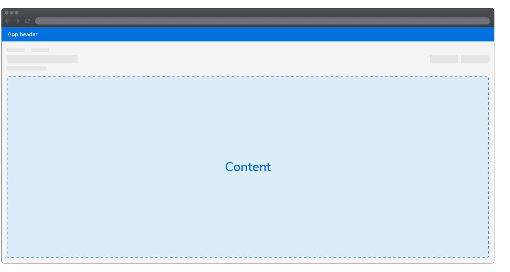
 

**Example**

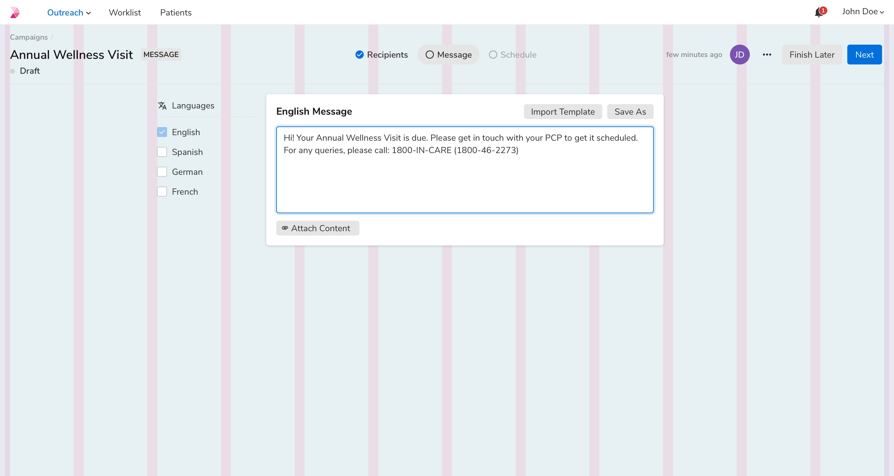
 

**Nested grid**

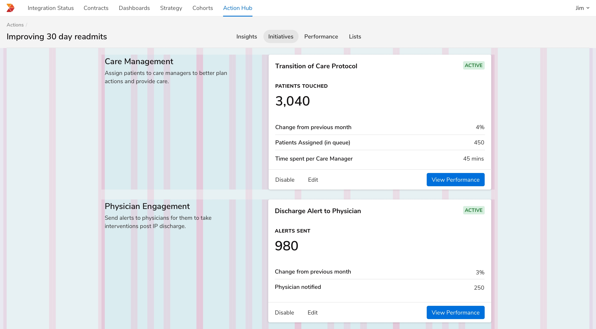
 
 

#### Sidebar template

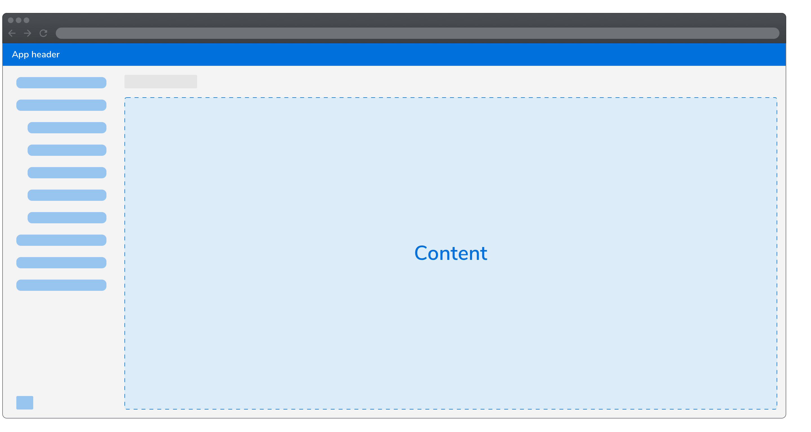
 

**Example**

 
 

#### Patient bar template

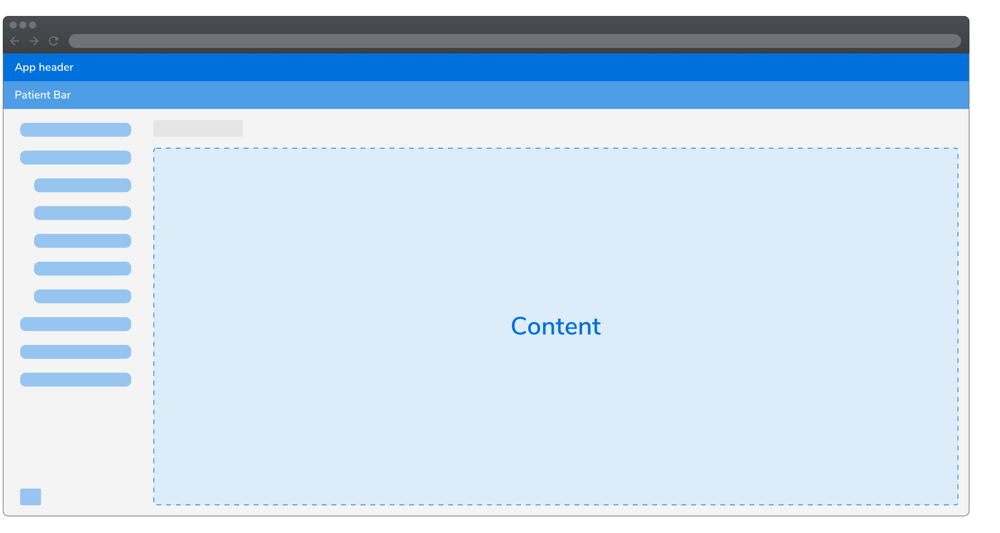
 

**Example**

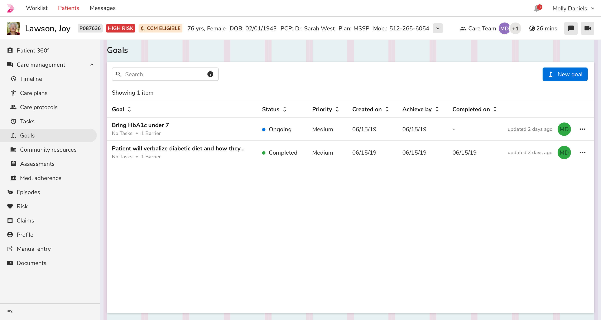
 
 

#### Mini sidebar template

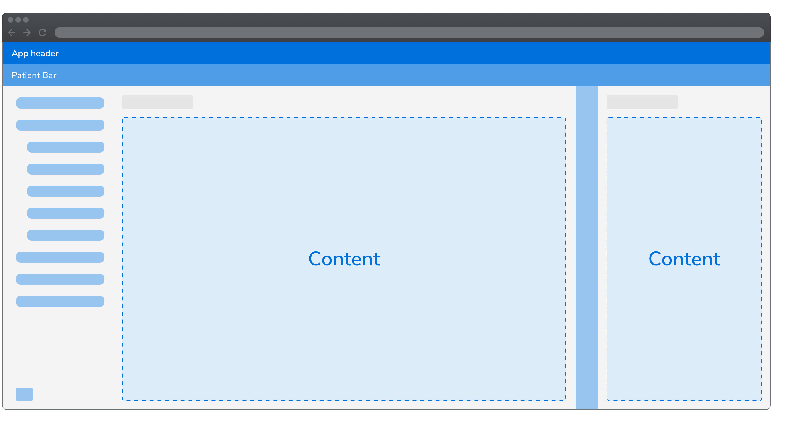
 

**Example**

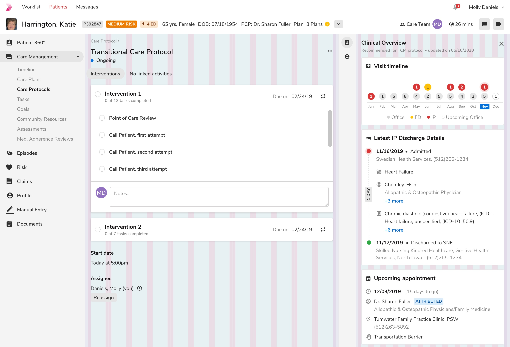
 
 

#### Content division
##### Full width

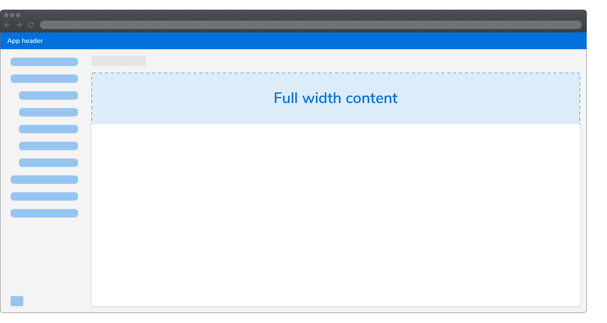
 

**Example**

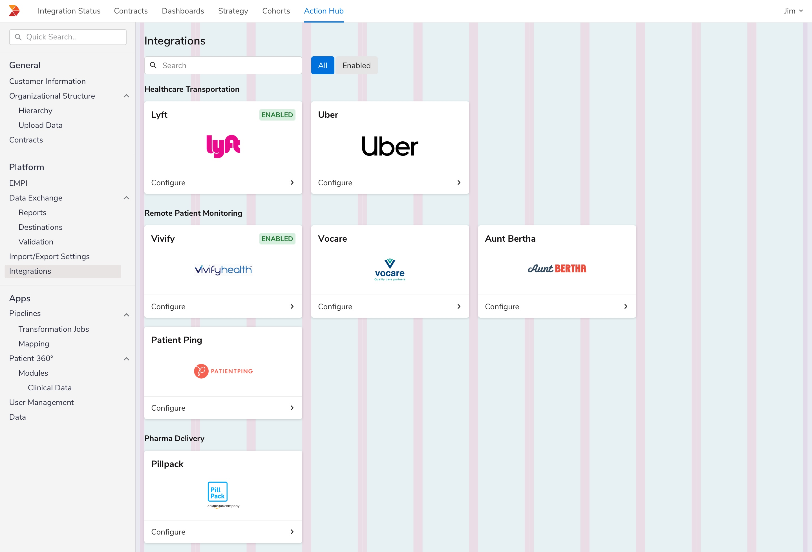
 
 

##### Narrow width content

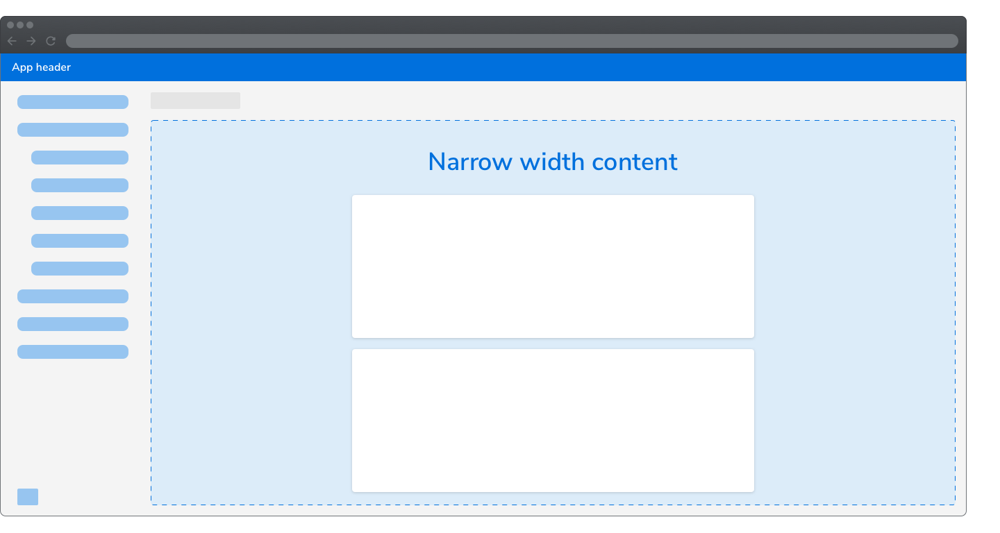
 

**Example**

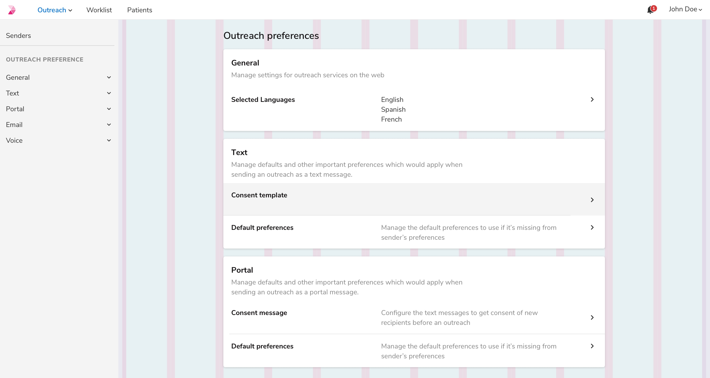
 
 