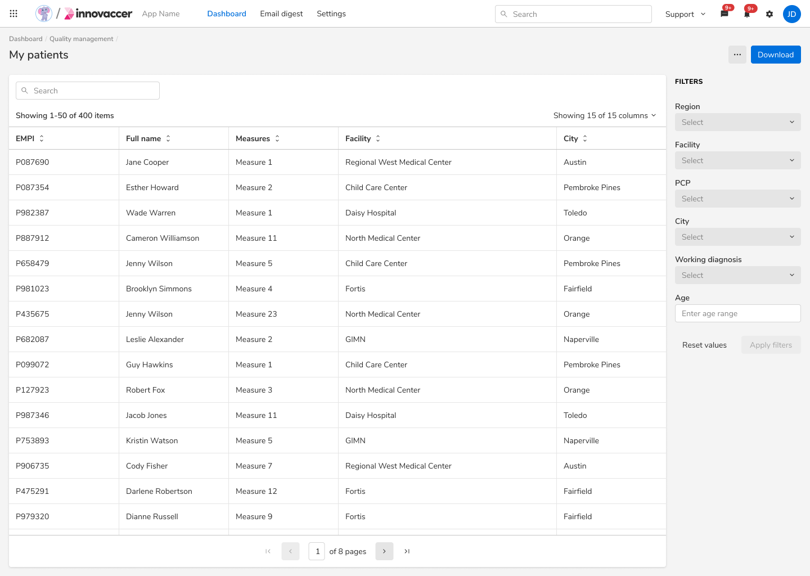
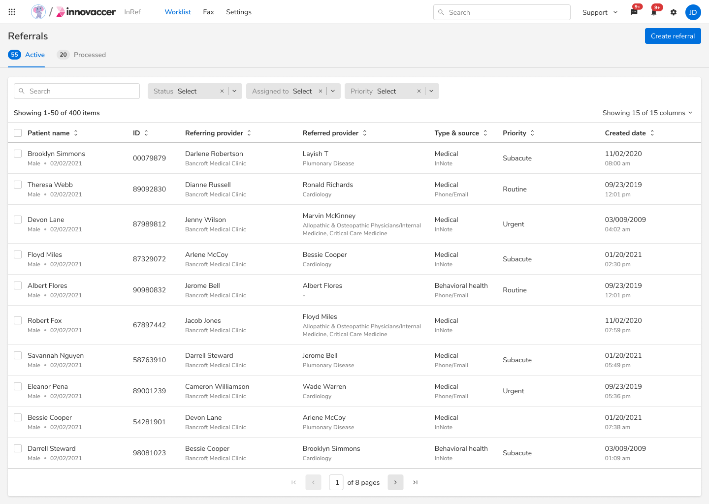
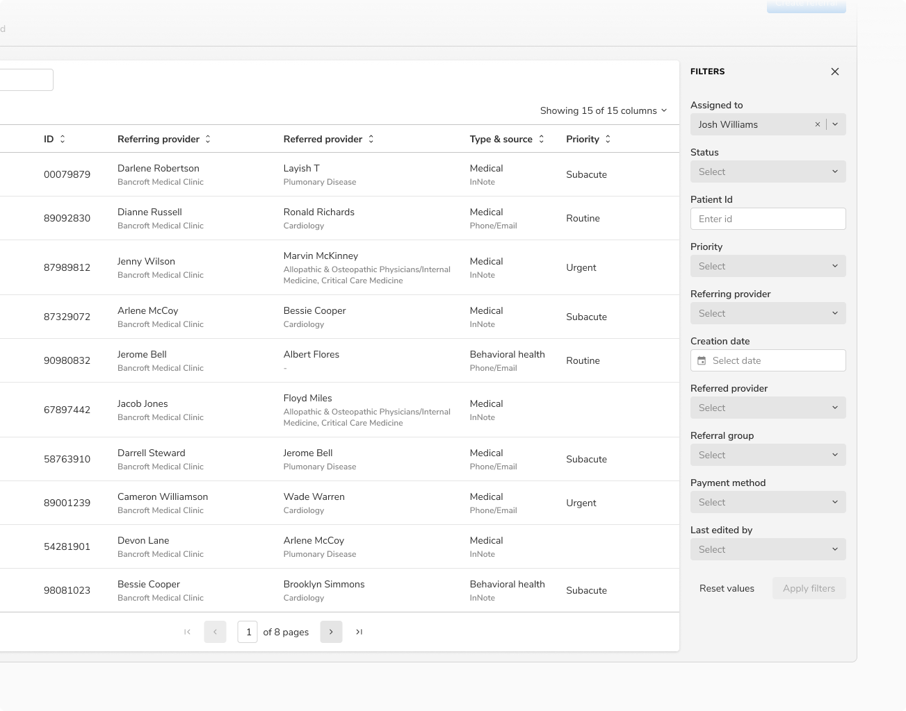
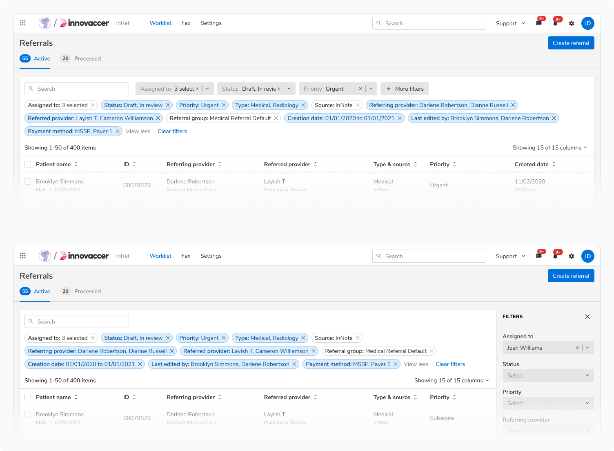

import tableFilterUsage1 from './images/tableFilterUsage-1.gif'
import tableFilterUsage2 from './images/tableFilterUsage-2.gif'
import tableFilterUsage3 from './images/tableFilterUsage-3.gif'
import tableFilterUsage4 from './images/tableFilterUsage-4.gif'
import tableFilterUsage5 from './images/tableFilterUsage-5.gif'
import tableFilterUsage6 from './images/tableFilterUsage-6.gif'
import tableFilterUsage7 from './images/tableFilterUsage-7.gif'
import tableFilterUsage8 from './images/tableFilterUsage-8.gif'

Filtering enables users to view the subset of the available data as per their needs.

### Usage

#### Position of filters
Filters can be placed either in the right side of the table or in the table header itself as quick filters. 

##### When filters are frequently used
Since the filters are frequently used, they are shown upfront in a panel. This panel appears on the right and cannot be closed. 
<b>Note:</b> In this case, there is no filtering option in the table itself.

 
 

<Caption> Frequently used filters in fixed section on right </Caption>

 
 

##### When filters are sparingly used
In case of 3 or fewer filters, all the filters are available in the table header for quick access.

<Caption> 3 or fewer filters available </Caption>

 
 

In case the need arises to use more than 3 filters, an additional button- “+ More filters” is used to reveal the panel on the right containing all the filters. However, in this case, the panel can be closed/opened on demand.

<b>Note:</b> First 3 filters from the panel are always shown as quick filters in the table header when the panel is closed.

 
 

<Caption> More than 3 filters available </Caption>

 
 

#### Applying filters

##### Instant application
In this approach, a filter is applied immediately as soon as a value is selected. This approach consumes too many API calls, so it is best to use when filters are used sparingly.

<Caption> Applying filters instantly without using an explicit “Apply filters” button. </Caption>

 
 

##### Batch application
In this approach, all the filters are applied at the end collectively, using an “Apply filters” button. The data set only refreshes at the user action, making it suitable for cases when: 

<ul>
    <li>The filters are used frequently</li>
    <li>Users can create their own filters</li>
</ul>

<Caption> Applying filters using “Apply filters” button </Caption>

 
 

#### Visibility of applied filters
The applied filters are shown using chips just below the search bar in the table header. Those chips can be used to quickly enable/disable an already applied filter. There is only one chip per column with its label highlighting the value as well as the name of the column.

<Caption> Applied filters being shown as chips. </Caption>

 
 

<b>Note:</b> The group of filter chips can be collapsed/expanded to view all the filter chips.

 
 

<Caption> Collapsed view of applied filter chips </Caption>

 
 

<Caption> Expanded view of applied filter chips </Caption>

 
 

#### Resetting filters
The applied filters can be removed using the “Clear filters” or “Reset values” action present in the table header and the filters panel respectively. 
The only difference is that the “Reset values” button will reset the filter values to their original values but the “Clear filters” button will clear all the filter values(including the default values if any).

<b>Note:</b> If a new filter has been added to the list, then the “Reset values” button will only reset its values whereas the “Clear filters” button will delete the added filter altogether.

 
 

<Caption> Resetting values using “Clear filter” button </Caption>

 
 

<Caption> Resetting values using “Reset values” button </Caption>

 
 

#### Adding new filters
In case of too many filters, not all columns are available to filter by default. In such cases, users can directly add filter(s) available on the data. 

<b>Note:</b> Add new filters functionality can only be handled from the filters panel.

 
 

<Caption> Adding a new filter </Caption>

 
 

#### Filter views
Applied filters can be saved as filter views so that the users can use the same set of filters in future.

##### Saving filter views
Applied filters can be saved as filter views using the “Save as filter view” action present at the end of the applied filters in the table header. 

<Caption> Saving a filter view </Caption>

 
 

##### Applying filter views
Users can pick and apply a previously saved filter view using the “Filter views” action present in the table header.  

<b>Note:</b> Users can make changes to the applied filter view and save it as a new one but they cannot update the existing filter view.

 
 

<Caption> Applying previously saved filter view </Caption>
 
 

#### Pinning
The filters panel allows users to pin the frequently used filters at the top for quick access.

<b>Note:</b> Irrespective of pinning, first 3 filters are always shown as quick filters in the table header when the filters panel is closed.

 
 

<Caption> Pinning a filter </Caption>

 
 

<Caption> Quick filters and filters panel behaviour with pinning </Caption>
 
 
