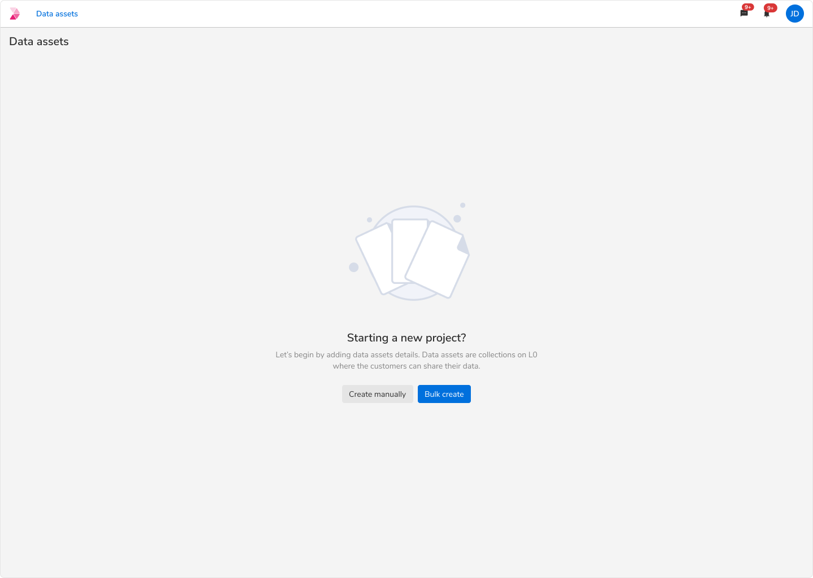
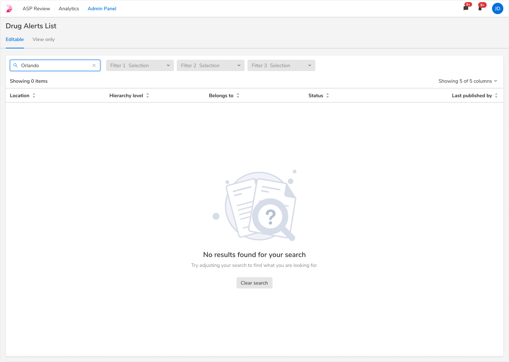
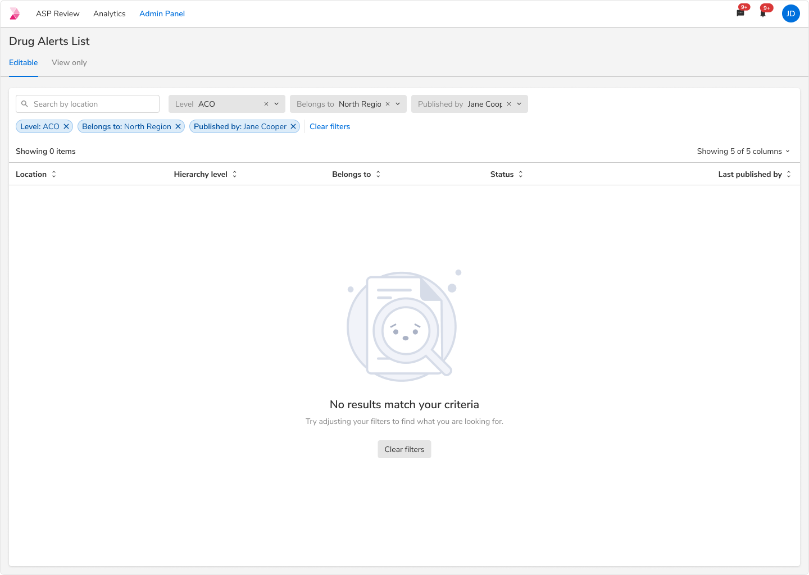
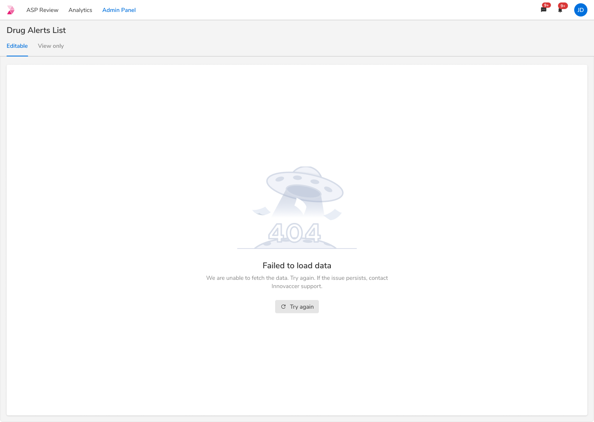
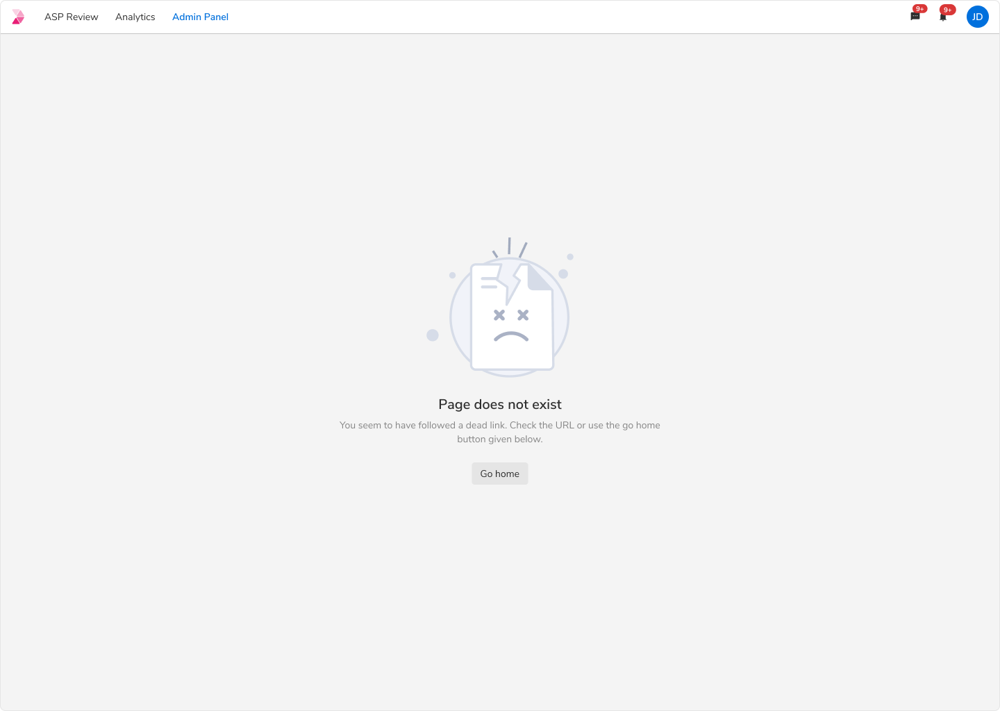
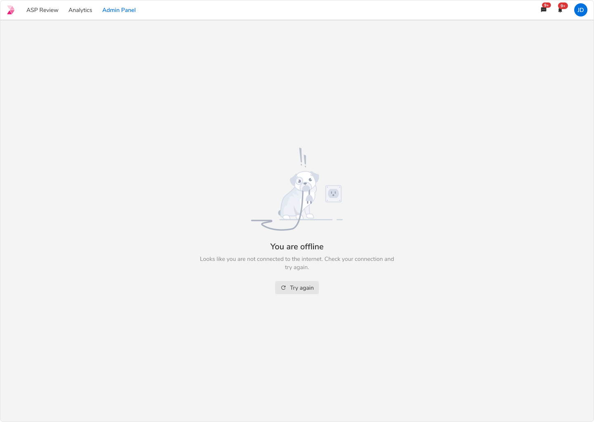
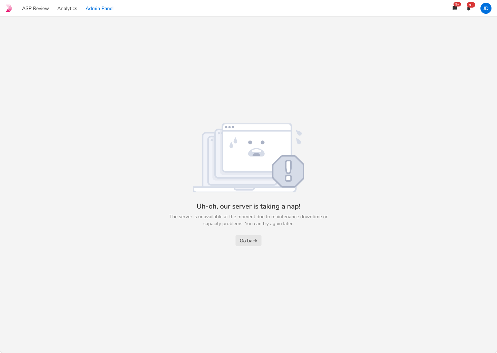
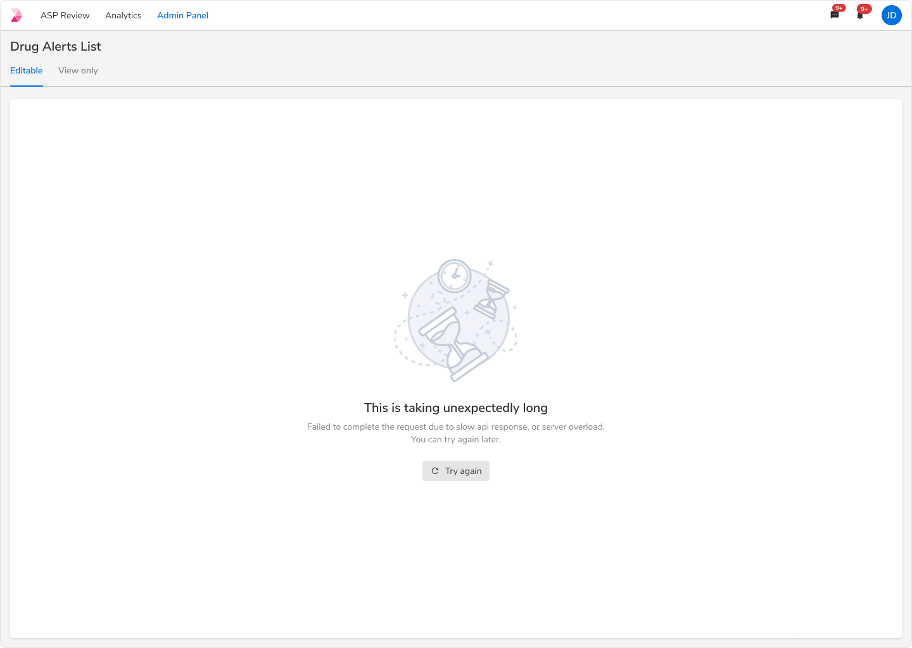

import noContentImage from './images/noContent.png';
import noSearch from './images/noSearch.png';
import pageNotLoaded from './images/pageNotLoaded.png';

UI states are used to inform users about the various states a page or container can be. There can be 4 possible states for a typical workflow:
1. Loading states
2. Content placeholders
3. Error states
4. Empty states

### Principles
* Load progressively.
* Skeleton over spinner.
* Show a progress bar if loading takes more than 1s.
* If the content or data may be empty after loading, use a spinner.
* Avoid flicker (showing an element and then removing it).
 

### Loading state
A typical process starts with loading the app first. If we go step by step -

<table style={{width: "100%"}}>
    <thead>
        <tr>
            <th align="left">State</th>
            <th align="left">Content type</th>
            <th align="left">Loader type</th>
        </tr>
    </thead>
    <tbody>
        <tr>
            <td>Loading the app</td>
            <td>Unpredictable</td>
            <td>Spinner</td>
        </tr>
        <tr>
            <td>Loading page template</td>
            <td>Predictable</td>
            <td>Skeleton</td>
        </tr>
        <tr>
            <td>Making API calls</td>
            <td>Data can be empty</td>
            <td>Spinner</td>
        </tr>
        <tr>
            <td>Making API calls</td>
            <td>Data will always be present</td>
            <td>Skeleton</td>
        </tr>
        <tr>
            <td>Searching</td>
            <td>Data can be empty</td>
            <td>Spinner</td>
        </tr>
        <tr>
            <td>Changing page</td>
            <td>Data will always be present</td>
            <td>Skeleton</td>
        </tr>
    </tbody>
</table>
 

### Examples
#### Loading the app

 
 

#### Loading the page template

 
 

#### Making API calls - Data can be empty

 
 

#### Making API calls - Data cannot be empty

 
 

#### Searching - Data can be empty

 
 

#### Pagination - Data cannot be empty

 
 

### Empty States

Empty state shows that there is no data to display. Such states can be utilized to educate users about the kind of content they can expect along with the next steps that they can take. 

**Note:** Please refer these comprehensive guidelines about empty states. 

#### No data state

This state occurs when the page is accessed for the first time, hence has no data to display. It should convey what users can expect once data is available, while providing constructive guidance about next steps.

**Note:** In such scenarios, a primary call to action can be used, provided there is no other primary call to action on the page. 

<Caption>UI state for no data</Caption>

#### Empty state based on user action

These empty states occur as consequences of user-initiated actions:

##### No search results

This state indicates that there are no search results and provides guidance on modifying search terms to proceed with the search.

<Caption>UI State for no search results</Caption>

##### No filter results

This state indicates the absence of results based on applied filter values and guides users on adjusting the filters to continue.

<Caption>UI State for no filter results</Caption>

### Error States

Error states are shown when things don’t go as expected, this could be due to system failure, bad internet, the user trying to perform actions that they don’t have access to, etc.

Users should be provided with a succinct yet descriptive message along with an action to resolve these error states.

Following are some of the common error types: 

#### Failed to fetch data

This state shows up when there are problems in fetching data from the system.

<Caption>Error while fetching data</Caption>

#### Page doesn’t exist

This state shows up when the requested page does not exist anymore.

<Caption>Page doesn’t exist</Caption>

#### Connectivity issues

Error state to convey the lost internet connection.

##### Opening/navigating to a new page

Error state while opening a new page or navigating to some other links. 

**Note:** The UI state should go away as soon as either the user click “Try Again” or the system is back online.

<Caption>Error while opening a new page with no internet connection</Caption>

##### Taking actions on the same page

For cases when users try to perform any action on the page having no internet, a prompt should be given stating the reason of the failure.

**Note:** The prompt will not go away until the system is back online.

<Caption>Error while taking action on the page with no internet connection</Caption>

#### Server unavailable

This state shows up when the server is unable to handle the request due to temporary overload. 

<Caption>UI state when server is unavailable</Caption>

#### Permission issue

This state shows up when the user does not have the access to view the requested content. 

<Caption>Error while viewing the restricted content</Caption>

#### Request timeout

System throws this error whenever there is a lot of delay in the response of a particular request. 

<Caption>Error to show request timeout</Caption>

### Flowchart

 
 