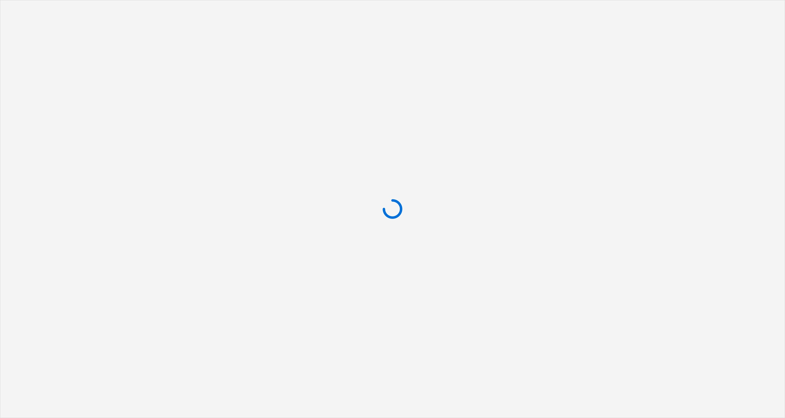
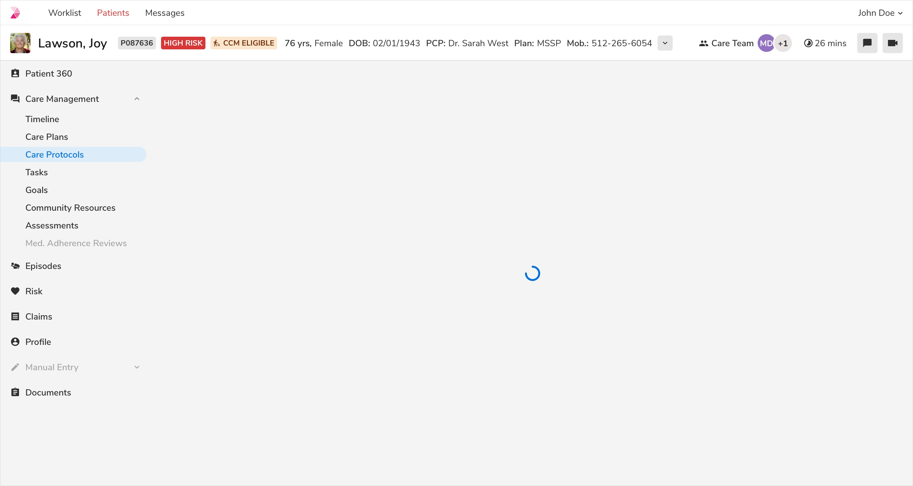
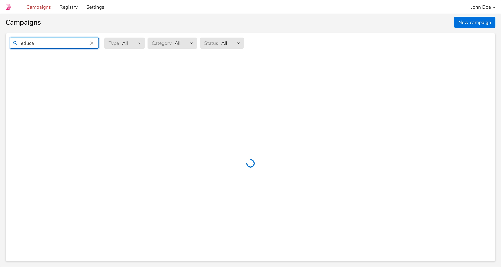
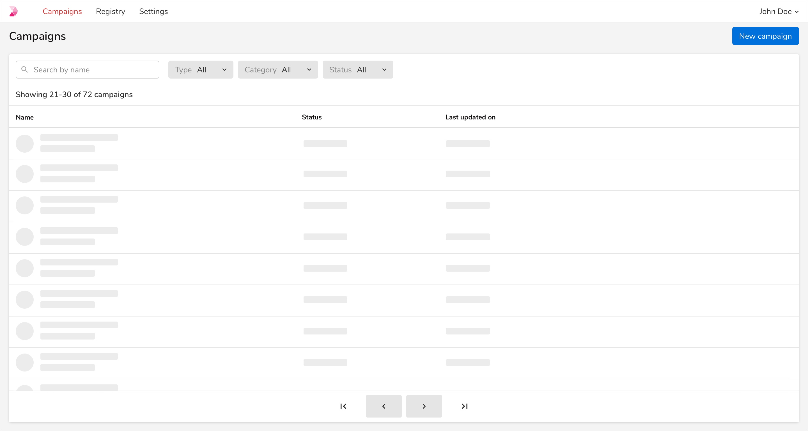
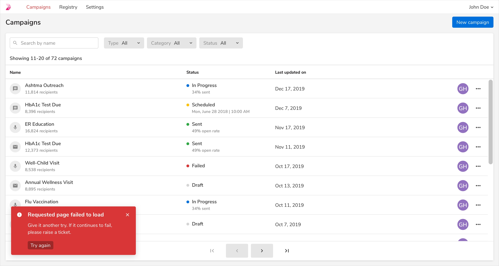
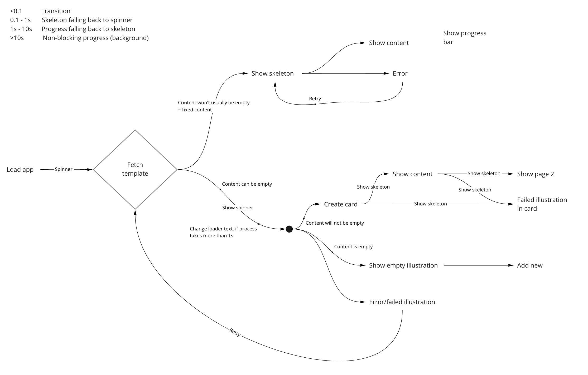

import noContentImage from './images/noContent.png';
import noSearch from './images/noSearch.png';
import pageNotLoaded from './images/pageNotLoaded.png';

UI states are used to inform users about the various states a page or container can be. There can be 4 possible states for a typical workflow:
1. Loading states
2. Content placeholders
3. Error states
4. Empty states

### Principles
* Load progressively.
* Skeleton over spinner.
* Show a progress bar if loading takes more than 1s.
* If the content or data may be empty after loading, use a spinner.
* Avoid flicker (showing an element and then removing it).
 

### Loading state
A typical process starts with loading the app first. If we go step by step -

<table style="width: 100%">
    <thead>
        <tr>
            <th align="left">State</th>
            <th align="left">Content type</th>
            <th align="left">Loader type</th>
        </tr>
    </thead>
    <tbody>
        <tr>
            <td>Loading the app</td>
            <td>Unpredictable</td>
            <td>Spinner</td>
        </tr>
        <tr>
            <td>Loading page template</td>
            <td>Predictable</td>
            <td>Skeleton</td>
        </tr>
        <tr>
            <td>Making API calls</td>
            <td>Data can be empty</td>
            <td>Spinner</td>
        </tr>
        <tr>
            <td>Making API calls</td>
            <td>Data will always be present</td>
            <td>Skeleton</td>
        </tr>
        <tr>
            <td>Searching</td>
            <td>Data can be empty</td>
            <td>Spinner</td>
        </tr>
        <tr>
            <td>Changing page</td>
            <td>Data will always be present</td>
            <td>Skeleton</td>
        </tr>
    </tbody>
</table>
 

### Examples
#### Loading the app

 
 

#### Loading the page template

 
 

#### Making API calls - Data can be empty

 
 

#### Making API calls - Data cannot be empty

 
 

#### Searching - Data can be empty

 
 

#### Pagination - Data cannot be empty

 
 

### Empty and Error States
 
 

<table style="width: 100%">
    <thead>
        <tr>
            <th align="left">State</th>
            <th align="left">Content</th>
            <th align="left">Card</th>
        </tr>
    </thead>
    <tbody>
        <tr>
            <td>No content available</td>
            <td>
                Blank screen with illustration
                 
                Educate the content about this module
                 
                Call to action (Create, search, etc)
            </td>
            <td>No</td>
        </tr>
        <tr>
            <td>No search results</td>
            <td>No results illustration</td>
            <td>Yes, if previously present</td>
        </tr>
        <tr>
            <td>Error (page not loaded)</td>
            <td>
                Blank screen with error illustration
                 
                Retry button
            </td>
            <td>No</td>
        </tr>
        <tr>
            <td>Error (search/filter/pagination)</td>
            <td>Toast with the error message and 'Try again' action</td>
            <td>Yes, if previously present</td>
        </tr>
    </tbody>
</table>
 
 

#### Examples
##### No content available

    <EmptyState 
        description="Campaigns let you reach out to patients with text messages, emails and voice calls" 
        imageSrc={noContentImage}
        size="large" 
        title="Manage your outreach campaigns"
    >
    <Button appearance="primary" size="large">
        Reload page
    </Button>
    </EmptyState>

 

<table style="width: 100%">
    <thead>
        <tr>
            <th style="width:33%; text-align: left;">Property</th>
            <th style="width:33%; text-align: left;">Value(s)</th>
            <th style="width:33%; text-align: left;">Default value</th>
        </tr>
    </thead>
    <tbody>
        <tr style="vertical-align: top">
            <td>Illustration</td>
            <td>
                Image
                 
                 
                <b>Image size</b>
                 
                Height - 128px
                 
                Width - Dynamic as per the height, maintaining the aspect ratio
            </td>
            <td>
                -
            </td>
        </tr>
        <tr style="vertical-align: top">
            <td>Title</td>
            <td>&#60;title&#62;</td>
            <td>We didn't find a match</td>
        </tr>
        <tr style="vertical-align: top">
            <td>Description</td>
            <td>&#60;description&#62;</td>
            <td>Try adjusting your search to find what you are looking for.</td>
        </tr>
        <tr style="vertical-align: top">
            <td>Button</td>
            <td>Label</td>
            <td>Try again</td>
        </tr>
    </tbody>
</table>

 
 

##### No search results

    <EmptyState 
        description="Try adjusting your search to find what you are looking for." 
        imageSrc={noSearch}
        size="small" 
        title="We didn't find a match"
    >
        <Button appearance="basic">
            Try Again
        </Button>
    </EmptyState>

 
<table style="width: 100%">
    <thead>
        <tr>
            <th style="width:33%; text-align: left;">Property</th>
            <th style="width:33%; text-align: left;">Value(s)</th>
            <th style="width:33%; text-align: left;">Default value</th>
        </tr>
    </thead>
    <tbody>
        <tr style="vertical-align: top">
            <td>Illustration</td>
            <td>
                Image
                 
                 
                <b>Image size</b>
                 
                Height - 256px
                 
                Width - Dynamic as per the height, maintaining the aspect ratio
            </td>
            <td>
                -
            </td>
        </tr>
        <tr style="vertical-align: top">
            <td>Title</td>
            <td>&#60;title&#62;</td>
            <td>Manage your outreach camaigns</td>
        </tr>
        <tr style="vertical-align: top">
            <td>Description</td>
            <td>&#60;description&#62;</td>
            <td>Campaigns let you reach out to patients with messages, emails and voice calls.</td>
        </tr>
        <tr style="vertical-align: top">
            <td>Button</td>
            <td>Label</td>
            <td>New campaign</td>
        </tr>
    </tbody>
</table>

 
 

##### Error (page not loaded)

    <EmptyState 
        description="A technical problem is preventing the page from loading. Try reloading this page." 
        imageSrc={pageNotLoaded} 
        size="large" 
        title="There's a problem loading this page."
    >
        <Button appearance="primary" size="large">
            Reload page
        </Button>
    </EmptyState>

 

##### Error (search/filter/pagination)
 

 
 
 

### Flowchart

 
 